# Jarvis Architecture — Phase 1

This document explains the shape of the codebase as of Phase 1
(architecture & scaffolding, no business logic) and the reasoning
behind each decision. It should be updated as later phases add
features, not left to drift.

## Contents

Each phase below documents *why*, not just *what* — see `README.md`'s
Status section for a one-paragraph summary of each phase's deliverable.
For static-structure (UML) diagrams, see `docs/diagrams.md`; for
deployment instructions, see `docs/deployment.md`.

- [Phase 1 — Design goals, folder-by-folder rationale](#design-goals-and-how-the-structure-serves-them) (this section)
- [Phase 2 — The Central Orchestrator](#phase-2--the-central-orchestrator)
- [Phase 3 — The Global Configuration System](#phase-3--the-global-configuration-system)
- [Phase 4 — The Filesystem Module](#phase-4--the-filesystem-module)
- [Phase 5 — Voice Support (Interfaces Only)](#phase-5--voice-support-interfaces-only)
- [Phase 6 — Whisper.cpp Integration](#phase-6--whispercpp-integration-reusable-speech-module)
- [Phase 7 — Piper Integration (TTS)](#phase-7--piper-integration-reusable-speech-module-tts-half)
- [Phase 8 — Wake Word Support](#phase-8--wake-word-support-openwakeword)
- [Phase 9 — The Cowork Integration Layer](#phase-9--the-cowork-integration-layer)
- [Phase 10 — The Internal Cowork Workspace](#phase-10--the-internal-cowork-workspace-specialist-collaborators)
- [Phase 11 — The Full Voice Pipeline](#phase-11--the-full-voice-pipeline-wired-together)
- [Phase 12 — The Memory Manager Collaborator](#phase-12--the-memory-manager-collaborator)
- [Phase 13 — The Obsidian Vault Connection](#phase-13--the-obsidian-vault-connection)
- [Phase 14 — Semantic Memory](#phase-14--semantic-memory)
- [Phase 15 — The Desktop Execution Engine](#phase-15--the-desktop-execution-engine)
- [Phase 16 — The Browser Agent](#phase-16--the-browser-agent)
- [Phase 17 — The Planning Engine](#phase-17--the-planning-engine)
- [Phase 18 — The Plugin Framework](#phase-18--the-plugin-framework)
- [Phase 19 — The Jarvis Security Manager](#phase-19--the-jarvis-security-manager)
- [Phase 20 — Autonomous Workflows](#phase-20--autonomous-workflows)
- [Phase 21 — Architectural Review & Production Readiness](#phase-21--architectural-review--production-readiness)
- [Phase 22 — The Prompt Registry](#phase-22--the-prompt-registry)

## Design goals, and how the structure serves them

| Requirement | How Phase 1 addresses it |
|---|---|
| Modular | Each concern (config, logging, DI, events, plugins, HTTP) is its own module under `core/`/`api/` with a single responsibility and no circular imports. |
| Plugin-based | `PluginBase` is the only contract features must satisfy. `PluginLoader` discovers and activates them from two independent sources (built-in namespace, external directory) so plugins can be added/removed without touching the core. |
| Event-driven | `EventBus` is the sanctioned way for one part of the system to react to another. Plugins are expected to communicate through it rather than importing each other directly. |
| Local-first | `data/`, `logs/`, `vault/` are all local directories, git-ignored, resolved relative to the project root — nothing here assumes a remote service. |
| Secure / permission-based | Deferred to the phase that introduces PyAutoGUI/Playwright/filesystem-touching plugins — flagged here so it isn't forgotten. Phase 1 lays the groundwork (plugins are explicitly enabled/disabled via config, not blanket-trusted) but does not yet implement a permission model. |
| Extensible | New capabilities are added as new plugins or new `core/` services, not by modifying existing modules. |

## Folder-by-folder rationale

- **`config/default.yaml`** — Committed, machine-independent defaults.
  Exists so a fresh checkout runs with zero setup. Never contains
  secrets; secrets/machine-specific values go in `.env` (git-ignored).

- **`data/`** — Where local-first state lives once later phases add it:
  the SQLite database, the FAISS index. Git-ignored because it's user
  data, not source. A `.gitkeep` keeps the empty directory in version
  control so `paths.data_dir` always resolves to something that exists.

- **`docs/`** — Architecture documentation that isn't appropriate to
  inline as code comments (rationale, diagrams, trade-offs). Kept in
  sync with the code manually — this file is expected to be edited
  every phase.

- **`logs/`** — Rotating log files written by `logging_setup.py`.
  Git-ignored for the same reason as `data/`.

- **`plugins/`** — The *external* plugin directory: where a user drops
  in third-party or personal plugins without touching Jarvis's source
  tree. Deliberately separate from `src/jarvis/plugins/` (built-in
  plugins) so upgrading Jarvis never overwrites a user's custom plugin,
  and so external plugins can be added/removed with zero code changes.

- **`src/jarvis/api/`** — The FastAPI application factory and HTTP
  routes. Isolated from `core/` because HTTP is one interface into
  Jarvis, not the system itself — a future CLI or desktop UI could sit
  alongside it without touching `core/`.

- **`src/jarvis/core/`** — The fixed infrastructure every other part of
  the app is built on: `config.py`, `logging_setup.py`, `container.py`,
  `events.py`, `plugin_loader.py`, `exceptions.py`. Nothing in this
  package knows about any specific feature (voice, browser control,
  notes) — that boundary is what keeps the core stable while plugins
  come and go.

- **`src/jarvis/plugins/`** — The *built-in* plugin namespace package.
  Empty in Phase 1 (no business logic yet); later phases add
  submodules here for capabilities that ship with Jarvis itself, as
  opposed to user-installed ones (which live in the top-level
  `plugins/` directory instead).

- **`src/jarvis/main.py`** — The startup sequence and nothing else. Every
  other module is reachable *from* this file's `bootstrap()`, so
  startup order is explicit and traceable in one place instead of
  scattered across import-time side effects.

- **`tests/`** — Mirrors the `src/jarvis/` package structure 1:1
  (`tests/core/test_container.py` tests `src/jarvis/core/container.py`,
  etc.), so any reader can find a module's tests by name alone.

- **`vault/`** — Root of the Obsidian vault Jarvis will read/write in a
  later phase. Present now, empty, so `paths.vault_dir` resolves
  correctly from day one and later phases don't need a path-migration
  step.

## Core building blocks

### Configuration (`core/config.py`)

`Settings` is a `pydantic-settings` model with four layered sources,
highest precedence first:

1. Explicit constructor kwargs (used by tests to inject fixtures).
2. Real process environment variables (`APP__NAME`, `LOGGING__LEVEL`, ...).
3. `.env` (git-ignored, machine-local overrides).
4. `config/default.yaml` (committed, shared defaults).

The `__` delimiter addresses nested fields from a flat env var
namespace. `Settings` is frozen (immutable) — runtime config changes
are expected to flow through the `EventBus`, not by mutating a shared
settings object, so every component that read a value earlier stays
consistent with every component that reads it later.

### Logging (`core/logging_setup.py`)

`configure_logging()` is called once, in `main.bootstrap()`, and
attaches a console handler and a `RotatingFileHandler` to the root
`jarvis` logger. Every other module logs via
`logging.getLogger(__name__)` as normal and inherits this
configuration — no module configures its own logging independently,
which is what keeps log format and destination consistent
process-wide.

### Service container (`core/container.py`)

A deliberately minimal registry (`register_instance` /
`register_factory` / `resolve`) rather than a full DI framework with
autowiring. Jarvis's service count is small enough that explicit
registration is easier to read and debug than reflection-based
wiring, and it keeps the container's behavior obvious to plugin
authors who are not framework experts.

### Event bus (`core/events.py`)

Synchronous, in-process pub/sub (`subscribe` / `publish` /
`publish_async`). Handlers run in registration order on the
publisher's call stack; an exception in one handler is logged and
does not prevent other subscribers of the same event from running.
This is the mechanism that keeps plugins decoupled: a plugin publishes
"something happened," and has no idea (or need to know) who, if
anyone, is listening.

### Plugin loader (`core/plugin_loader.py`)

Discovers `PluginBase` subclasses from two sources — the built-in
`jarvis.plugins` namespace package, and the external directory named
by `paths.plugins_dir` — then filters them through
`plugins.enabled`/`plugins.disabled` config before instantiating and
calling `on_load(container, events)`. A plugin that fails to import or
raises during `on_load` is reported as a `PluginLoadError`; one broken
plugin does not prevent others from loading.

### Startup sequence (`main.py`)

```
load .env → build Settings → configure logging → create ServiceContainer
   → register Settings + EventBus → create + run PluginLoader
   → build FastAPI app from the container → serve with uvicorn
```

`bootstrap()` performs everything up to and including plugin loading
and returns the populated container; `main()` adds the HTTP server on
top. This split lets tests exercise the full wiring without binding a
port.

## Diagrams

### System overview

```mermaid
flowchart TB
    subgraph Startup["main.py: bootstrap()"]
        ENV[".env / environment"] --> CFG["Settings\n(core/config.py)"]
        CFG --> LOG["configure_logging()\n(core/logging_setup.py)"]
        LOG --> SC["ServiceContainer\n(core/container.py)"]
        SC --> EB["EventBus\n(core/events.py)"]
        EB --> PL["PluginLoader\n(core/plugin_loader.py)"]
    end

    PL -->|discovers| BUILTIN["src/jarvis/plugins/*\n(built-in)"]
    PL -->|discovers| EXTERNAL["plugins/*\n(external, user-installed)"]
    BUILTIN -->|on_load(container, events)| PL
    EXTERNAL -->|on_load(container, events)| PL

    SC --> APP["FastAPI app\n(api/app.py)"]
    APP --> HEALTH["/health"]

    SC -.resolve.-> CFG
    SC -.resolve.-> EB
```

### Startup sequence

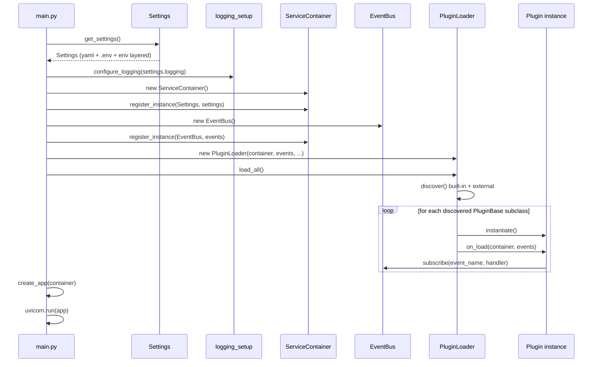

### Plugin lifecycle

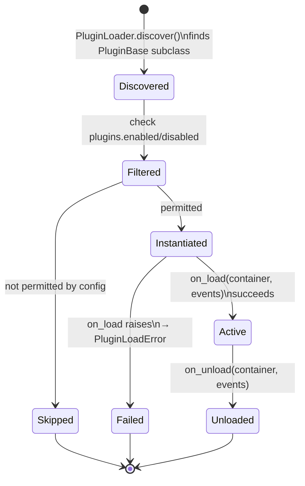

## What Phase 1 deliberately does not include

- No built-in plugins (voice, browser automation, notes, memory/search) —
  `src/jarvis/plugins/` is an empty namespace package.
- No permission/security model for plugin capabilities — needed before
  any plugin gets filesystem, browser, or input-device access.
- No database, no vector index — `data/` exists but nothing writes to
  it yet.
- No async plugin lifecycle (hot reload, dependency ordering between
  plugins) — `PluginLoader` loads everything once, in discovery order.
- No central request-handling pipeline — added in Phase 2.

These are flagged here so later phases can address them deliberately
rather than by accretion.

---

# Phase 2 — The Central Orchestrator

Phase 2 adds `src/jarvis/orchestrator/`: the one place that turns a
raw request into a response. Its responsibilities, and how the design
maps to each:

| Responsibility | How it's implemented |
|---|---|
| Receive requests | `Orchestrator.handle(Request)` — one pipeline, channel-agnostic (`Request.source` distinguishes api/voice/cli without branching logic). |
| Understand intent | `IntentRecognizer` port; default `PatternIntentRecognizer` matches text against patterns plugins registered. |
| Route requests | `CapabilityRegistry` — plugins register `(name, patterns, handler)`; the orchestrator only calls `registry.get()`/`registry.match()`, never a plugin class. |
| Manage state | `SessionStore` + `Session` — short-lived, in-process conversation history and a per-session context dict, separate from long-term memory. |
| Call plugins | Capability handlers, invoked through `CapabilityContext`, with exceptions isolated per-call. |
| Call memory | `MemoryPort` — `recall()` before dispatch, `remember()` after every turn, unconditionally, via the Null Object default until a real backend exists. |
| Call automation | `AutomationPort` — injected into `CapabilityContext` so only the orchestrator ever hands out a reference to it; plugins never import a concrete automation backend. |

## Why dependency injection, specifically

Every collaborator (`EventBus`, `CapabilityRegistry`, `IntentRecognizer`,
`SessionStore`, `MemoryPort`, `AutomationPort`) is passed into
`Orchestrator.__init__` as an already-constructed object — the class
never does `from jarvis.something import ConcreteThing` for any of
them. `main.bootstrap()` is the only place that decides which concrete
`IntentRecognizer` or `MemoryPort` implementation is in play. Two
consequences fall out of this directly:

- **Testability.** `tests/orchestrator/conftest.py` builds an
  `Orchestrator` with `FakeMemoryPort`/`FakeAutomationPort` test
  doubles that satisfy the port shape but do nothing real — no test
  needs a database or PyAutoGUI installed.
- **Replaceability.** When a later phase adds a SQLite/FAISS-backed
  `MemoryPort`, the change is a one-line swap in `bootstrap()`
  (`container.register_instance(MemoryPort, RealMemory(...))`) — every
  other file in `orchestrator/` is untouched.

## Why `Protocol` instead of an ABC

`ports.py` defines `MemoryPort`, `AutomationPort`, and
`IntentRecognizer` as `typing.Protocol` classes rather than abstract
base classes. A `Protocol` is satisfied structurally — a class matches
the port just by having the right methods, without importing
`ports.py` or subclassing anything. This matters because it means the
dependency arrow only ever points one way: `orchestrator/` depends on
the *shape* of memory/automation, but a future memory or automation
plugin depends on nothing from `orchestrator/` at all (see
`tests/orchestrator/conftest.py`'s `FakeMemoryPort`, which satisfies
`MemoryPort` with zero inheritance).

## Why the CapabilityRegistry — and not a hardcoded dispatch table

The alternative to a registry would be the orchestrator itself
containing something like `if intent == "open_browser": ... elif
intent == "take_note": ...` — which is exactly the coupling the
requirements ruled out ("the assistant should not know implementation
details of plugins"). Instead:

- A plugin calls `container.resolve(CapabilityRegistry).register(...)`
  from its own `on_load()` (see
  `tests/test_plugin_orchestrator_integration.py::GreeterPlugin` for a
  complete example).
- The same registry drives *both* routing (`registry.get(intent.name)`)
  and intent recognition (`registry.match(text)` in
  `PatternIntentRecognizer`), so there is exactly one source of truth
  for "what capabilities exist and what triggers them" — no separate
  intent list to keep in sync.
- Unloading a plugin (`registry.unregister_all_for_plugin(name)`)
  removes its capabilities from routing immediately, mirroring the
  `EventBus.unsubscribe` cleanup pattern from Phase 1.

## Why Null Object defaults for Memory and Automation, not `Optional`

`main.bootstrap()` registers `NullMemoryPort` and `NullAutomationPort`
by default rather than leaving `MemoryPort`/`AutomationPort`
unregistered. The alternative — `container.has(MemoryPort)` checks
scattered through `Orchestrator.handle()` — would mean every future
reader has to reason about two different code paths (memory present /
memory absent) forever, even after a real backend always exists in
production. A Null Object is a complete, real implementation of "no
backend configured" (see its docstring in `ports.py`) — not a stub
standing in for unwritten logic — so `Orchestrator.handle()` can call
`self._memory.recall(...)` / `self._memory.remember(...)`
unconditionally, and stays exactly as simple once a real `MemoryPort`
is registered as it is today.

## Why Session state is separate from MemoryPort

`SessionStore`/`Session` (short-lived, in-process, gone on restart) and
`MemoryPort` (long-term, meant to survive restarts, backed by
SQLite/FAISS in a later phase) look similar but answer different
questions: Session state is "what did we just say in this
conversation" (needed by every request, always available, never
persisted); memory is "what do we know about this user/topic in
general" (optional today, persisted, potentially large). Conflating
them would force every plugin author to guess whether a given piece of
state belongs in one or the other; keeping them as two distinct types
in `models.py`/`ports.py` makes the distinction a compiler-visible
choice instead of a convention someone has to remember.

## Request-handling pipeline

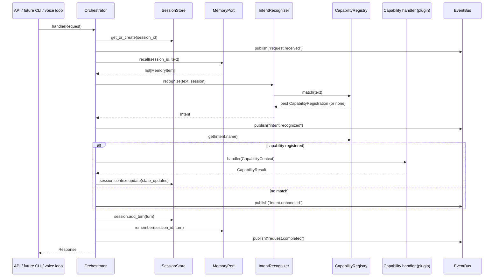

## Component / dependency-direction diagram

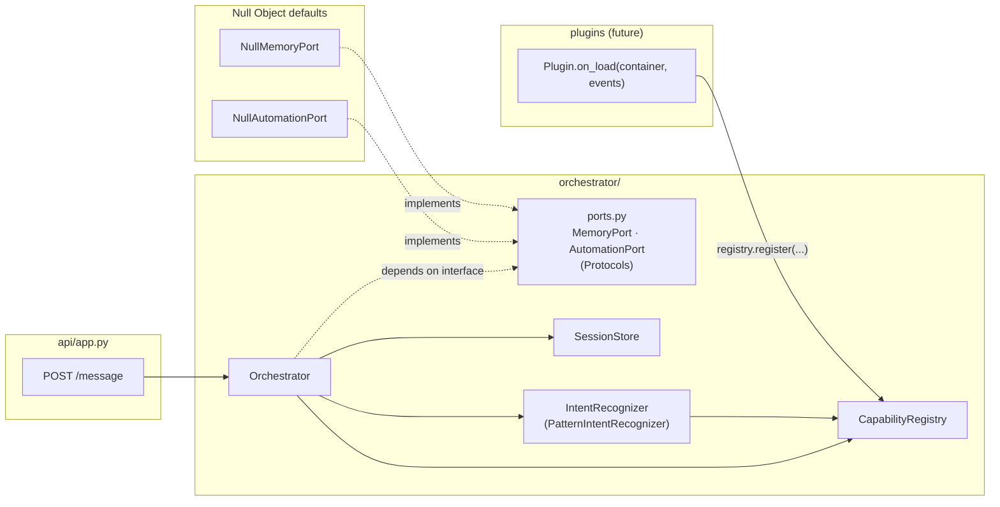

Note the direction of every arrow into `PORTS`: the orchestrator
depends on the interface, and both the Null defaults and any future
real backend depend on the same interface — never on the orchestrator
or on each other.

## What Phase 2 deliberately does not include

- No LLM-backed intent recognition — `PatternIntentRecognizer` is
  regex-based on purpose, so intent routing has one source of truth
  (the CapabilityRegistry) with zero external dependencies. Swappable
  later behind the same `IntentRecognizer` Protocol.
- No real `MemoryPort` implementation (SQLite/FAISS) — `NullMemoryPort`
  is the permanent default until that phase.
- No real `AutomationPort` implementation (PyAutoGUI/Playwright) —
  same reasoning, `NullAutomationPort`.
- No built-in capability plugins — `src/jarvis/plugins/` is still
  empty; `tests/test_plugin_orchestrator_integration.py` demonstrates
  the mechanism with a test-only plugin, not a shipped feature.
- No authentication/authorization on `/message` — anyone who can reach
  the API can invoke any registered capability. Needed before any
  capability can take a destructive or sensitive action.
- No async orchestration — `Orchestrator.handle()` and the ports are
  synchronous. FAISS/Playwright-backed implementations may need async
  I/O in a later phase; when that happens, either the ports gain async
  variants or the sync calls run in FastAPI's thread pool. Not decided
  yet — flagged here rather than guessed at.

---

# Phase 3 — The Global Configuration System

Phase 3 adds `src/jarvis/core/config/`: five YAML files, one typed
pydantic model per file, loaded, validated, and (optionally) live-reloaded
by `ConfigManager`.

| File | Model | Covers |
|---|---|---|
| `settings.yaml` | `Settings` | app identity, logging, paths, API bind address, live-reload behavior |
| `permissions.yaml` | `PermissionsConfig` | per-plugin capability allow/deny rules |
| `voice.yaml` | `VoiceConfig` | wake word / speech-to-text / text-to-speech |
| `memory.yaml` | `MemoryConfig` | short-term (session) + long-term (SQLite/FAISS) memory |
| `plugins.yaml` | `PluginsConfig` | which plugins load, per-plugin config blobs |

## Why not `pydantic-settings` for every domain

Phase 1's original `Settings` used `pydantic-settings`'s `BaseSettings`
for its automatic env/`.env`/YAML layering. Phase 3 needs `ConfigManager`
to point every domain at a *configurable* `config_dir` (the real
`config/` directory in production, `tmp_path` in tests) — and
`pydantic-settings` 2.14 has no supported way to override a
`BaseSettings` subclass's YAML file path per-instance (verified against
`BaseSettings.__init__`'s actual signature; only `_env_file`,
`_secrets_dir`, and similar are exposed — there is no `_yaml_file`).
Rather than fight the library with unsupported internals (mutating
`model_config` on the class itself, which is shared, global, and not
safe for concurrent `ConfigManager` instances), `core/config/loader.py`
implements the same idea directly: read YAML into a dict (`{}` if the
file is absent, so the model's own defaults apply), optionally merge an
environment-derived dict on top, then validate with
`model.model_validate(...)`. This is a few dozen lines, fully owned,
trivially testable with `tmp_path`, and gives every domain — not just
`Settings` — identical error handling for free.

`.env` support falls out of this almost for free: `main.bootstrap()`
calls `load_dotenv()` before `ConfigManager` is constructed, and
`python-dotenv`'s default `override=False` means a real environment
variable always wins over the same key in `.env`. `loader.env_overrides()`
then just reads `os.environ`, which by that point already reflects both
— so the loader only has to implement one precedence layer (env-derived
dict over YAML-derived dict), not three.

## Why only `settings.yaml` supports environment-variable overrides

`Settings` covers exactly the values likely to differ per-deployment
(dev vs. prod, CI, a given machine's paths, the API bind address) — the
things a 12-factor app typically wants overridable without editing a
committed file. `permissions.yaml`/`voice.yaml`/`memory.yaml`/`plugins.yaml`
are domain configuration meant to be read and edited directly; giving
them an env-override layer too would mean two competing sources of
truth for, say, which plugins are enabled, with no clear reason a
deployment would need to override that via an env var instead of just
editing the file. Keeping the asymmetry explicit (documented here, and
in each model's own docstring) beats implementing it uniformly "for
consistency" and then not being able to explain why anyone would use it
on four of the five files.

## Why fail-fast at startup but fail-safe at reload

`ConfigManager.__init__` lets `ConfigurationError` propagate: an
invalid config at process startup should stop the process before it
binds a port, loads a plugin, or serves a single request — there is no
"previous good config" to fall back to yet, so failing loudly is the
only correct behavior. `ConfigManager.reload()` — called by the
background watcher, or manually — instead catches `ConfigurationError`,
logs it, publishes `"config.reload_failed"`, and keeps the last
successfully-loaded config in place. A typo saved mid-edit to a running
assistant's `settings.yaml` must not take it down; the file watcher
polls every `poll_interval_seconds` (default 2s), so the fix is just
"save it correctly" on the next poll, not "restart the service." This
asymmetry is deliberate and total: no code path re-raises a reload
failure, and no code path swallows a startup failure.

## Why polling instead of a filesystem-event watcher

`ConfigManager._watch_loop` compares file `mtime`s on a
`threading.Event.wait(poll_interval_seconds)` loop rather than using
OS-level filesystem event notifications (which is what a `watchdog`
dependency would provide). Config files change at most a few times per
session — there is no latency requirement that justifies a new
dependency and its own failure modes (inotify limits on Linux, ReadDirectoryChangesW
quirks on Windows) for something a 1-2 second poll already satisfies.
If plugins/features are added later that need sub-second config
propagation, that's a reason to reconsider — not a reason to add the
dependency speculatively now.

## Why every config model is frozen, and what replaces mutation

Every domain model (`Settings`, `PermissionsConfig`, `VoiceConfig`,
`MemoryConfig`, `PluginsConfig`, and their nested sub-models) sets
`model_config = ConfigDict(frozen=True)`. Config is a value, not
something code mutates in place — when a file changes on disk,
`ConfigManager._load_all()` builds an entirely new `LoadedConfig` and
swaps it in under a lock (`ConfigManager.reload()`); nothing ever does
`settings.app.debug = True`. This is the same rationale Phase 1 applied
to the original `Settings`, now applied consistently across all five
domains, including their nested sub-models (Phase 1's `Settings` was
frozen at the top level only — a gap closed here).

## Why `PermissionsConfig.is_allowed()` exists but isn't called yet

Modeling `permissions.yaml` as a bare list of allow/deny rules would be
an incomplete schema: without fixed precedence rules (does deny beat
allow? does an exact plugin-name rule beat a `"*"` wildcard rule?), two
different reviewers could read the same YAML file and reach different
conclusions about what it permits. `PermissionsConfig.is_allowed()`
fixes that precedence as code, tested directly
(`tests/core/config/test_permissions_config.py`), so the schema is
unambiguous before anything depends on it. What's deliberately *not*
here yet is enforcement: no `AutomationPort` implementation or
capability-handler wrapper calls `is_allowed()`. That's scoped to
whichever future phase adds real automation (PyAutoGUI/Playwright) and
therefore has an actual place to put the check — most likely inside a
real `AutomationPort.execute()`, or a thin decorator the orchestrator
applies around capability handlers.

## Live reload, end to end

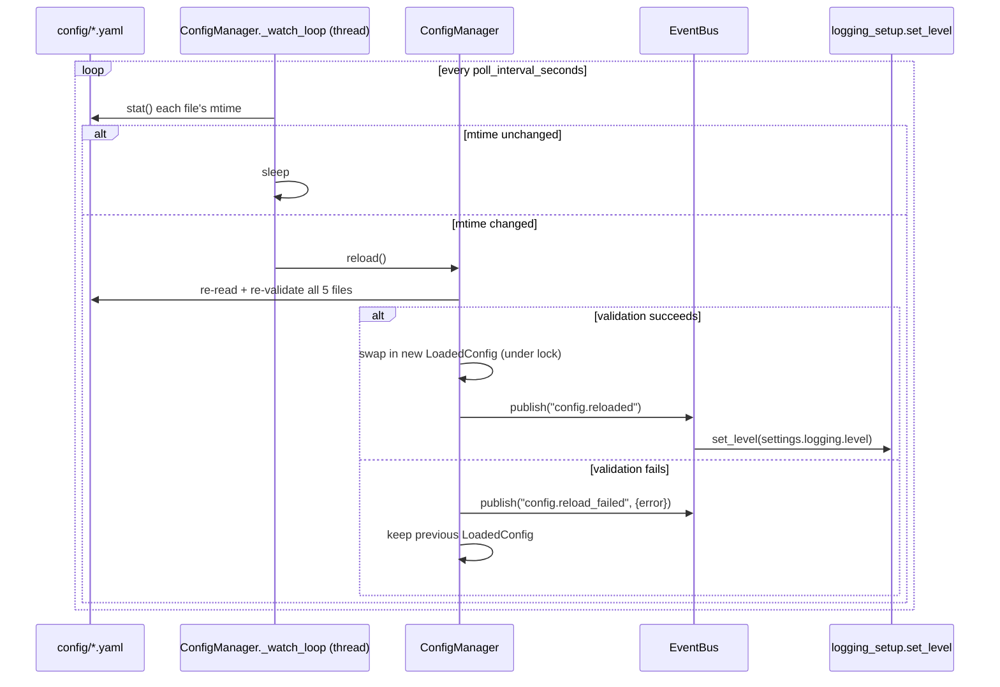

`main.bootstrap()` subscribes `logging_setup.set_level` to
`"config.reloaded"` as the one concrete, wired-up example of "a
subsystem reacting to live-reloaded config" — proof the event fires
with the right data, not just that `ConfigManager` fires it into the
void. Any future subsystem (e.g. a voice plugin re-reading
`voice.yaml`'s wake-word threshold) subscribes the same way.

## Component diagram

```mermaid
flowchart LR
    subgraph Files["config/*.yaml"]
        F1["settings.yaml"]
        F2["permissions.yaml"]
        F3["voice.yaml"]
        F4["memory.yaml"]
        F5["plugins.yaml"]
    end

    subgraph Loader["core/config/loader.py"]
        L["read_yaml_mapping · env_overrides\ndeep_merge · load_typed_config"]
    end

    subgraph Models["typed models"]
        M1["Settings"]
        M2["PermissionsConfig"]
        M3["VoiceConfig"]
        M4["MemoryConfig"]
        M5["PluginsConfig"]
    end

    CM["ConfigManager\n(LoadedConfig snapshot + reload() + watcher)"]

    Files --> L --> Models --> CM
    ENV[".env / real env vars"] -.only settings.yaml.-> L
    CM -->|".settings .permissions .voice\n.memory .plugins"| Consumers["main.py · api/app.py\nfuture plugins"]
    CM -->|"config.reloaded\nconfig.reload_failed"| EB2["EventBus"]
```

## What Phase 3 deliberately does not include

- No enforcement of `permissions.yaml` — `is_allowed()` is implemented
  and tested, but nothing calls it (see above).
- No env-var override support for permissions/voice/memory/plugins —
  deliberate asymmetry, see above.
- No filesystem-event watcher — mtime polling only (see above).
- No wiring of `plugins.yaml`'s per-plugin `plugins:` config map into
  `PluginLoader` or `PluginBase` — the schema is validated, but there's
  no `PluginBase.configure(dict)` hook yet for a plugin to receive it.
  Same "define the schema before the consumer exists" pattern already
  used for `voice.yaml`/`memory.yaml`.
- No wiring of `memory.yaml`'s `short_term.max_turns` into
  `Session.max_history` — `Session` still uses its own hardcoded
  default; consulting `MemoryConfig` is for whichever phase gives the
  orchestrator a reason to depend on it.
- No config *validation CLI* (e.g. `jarvis config check`) — validation
  currently only happens as a side effect of constructing a
  `ConfigManager`, which is sufficient for Phase 3's scope but not a
  substitute for a dedicated pre-flight command a deployment script
  could run.
- No secrets handling — `permissions.yaml`'s example includes an API
  key referenced by *environment variable name*
  (`api_key_env_var: WEATHER_API_KEY`), not a literal key, but nothing
  in the config system enforces that convention or integrates with a
  secrets manager.

---

# Phase 4 — The Filesystem Module

Phase 4 adds `src/jarvis/core/filesystem/`: a real, working
implementation of copy/move/rename/delete/search/read/write, gated by
an allowlist/blacklist and a hardcoded protection floor, with every
operation logged and destructive operations requiring explicit
confirmation. It also adds `filesystem.yaml` as a sixth config domain —
proof of the extensibility Phase 3's `loader.py` docstring promised
("a sixth domain added later only needs a model class, not new
plumbing"): no change to `core/config/loader.py` or `ConfigManager`'s
public shape was needed, only a new model file and four lines in
`manager.py`.

| Requirement | How it's implemented |
|---|---|
| Allowlist folders | `filesystem.yaml`'s `allowed_dirs` — anything not inside one of these is denied. |
| Blacklist folders | `filesystem.yaml`'s `blacklisted_dirs` — an explicit deny, wins even nested inside an allowed dir. |
| Prevent access outside allowed directories | `PathGuard.check()`'s allowlist check, applied to every path before any operation touches disk. |
| Prevent edits to Windows/Program Files/Registry/System32 | `PROTECTED_SYSTEM_PATHS` — hardcoded, environment-aware, checked first, not configurable by anything. |
| copy / move / rename / delete / search / read / write | `LocalFilesystemService`, implementing the `FilesystemPort` Protocol. |
| All operations logged | Every method funnels through `_prepare()`/`_succeed()`/`_fail()`/`_require_confirmation()` — logging is a property of the class's shape, not of each method remembering to do it. |
| Confirmation before destructive actions | `confirmed: bool = False` on delete/move/rename/copy/write; an operation named in `require_confirmation` raises `ConfirmationRequiredError` unless the caller passes `confirmed=True`. |

## Why a hardcoded floor, not just a well-chosen default blacklist

`filesystem.yaml`'s `blacklisted_dirs` is configuration — anything in
config can be misconfigured, edited by mistake, or (once plugins can
write config) overwritten by something with bad intentions. "Never
edit Windows/Program Files/System32/the registry" is not meant to be a
*default* someone could accidentally relax; it's meant to be a
guarantee. `PROTECTED_SYSTEM_PATHS` (`path_guard.py`) is therefore a
plain Python tuple, computed once from environment variables
(`%WINDIR%`, `%ProgramFiles%`, ...) at import time, checked *before*
the user-configurable blacklist, and not reachable from any YAML file,
config model, or public API. `test_protected_system_paths_are_always_denied_even_if_allowlisted`
(in `tests/core/filesystem/test_path_guard.py`) verifies this directly:
even an `allowed_dirs: ["C:/"]` config — as permissive as it's possible
to be — still can't reach `C:\Windows\System32`.

"Registry" specifically isn't a filesystem path (Windows exposes it
through `winreg`, not files) — protection here means two things
together: the filesystem module exposes no registry API at all (only
file operations, full stop), and the on-disk hive files under
`%WINDIR%\System32\config` (where `SAM`, `SYSTEM`, `SOFTWARE` actually
live on disk) are covered by the same protected-path check as the rest
of `System32`.

## Why paths resolve against the project root, never the CWD

`PathGuard._normalize_config_path()` joins every relative path — both
`filesystem.yaml`'s configured directories and a caller-supplied
target — against `PROJECT_ROOT` (or a `root` passed in for testing),
never against `Path.cwd()`. If relative paths resolved against the
process's actual working directory instead, the *same* call —
`read("notes.txt")` — could resolve somewhere different depending on
where Jarvis happened to be launched from, which is exactly the kind
of ambiguity a working-directory trick could exploit to reach a file
outside the intended directory. Resolving against a fixed root removes
that variable entirely: `filesystem.yaml`'s `allowed_dirs: [data,
vault]` means the *same* two directories regardless of CWD.

## Precedence order, and why it's fixed

`PathGuard.check()` always evaluates in this order:

    1. Protected system paths (hardcoded) — always denied.
    2. Blacklisted directories (config) — denied, even nested inside an allowed dir.
    3. Allowed directories (config) — must be inside one of these, or denied.

This is the same "deny beats allow, most specific/hardcoded wins
first" shape as `PermissionsConfig.is_allowed()` from Phase 3, applied
here to filesystem paths. Keeping the two precedence systems shaped
the same way (rather than each inventing its own rules) means a reader
who understands one already understands the other.

## Why confirmation is a boolean parameter, not an interactive prompt

`LocalFilesystemService` has no concept of a user, a terminal, or a
chat/voice channel to ask "are you sure?" through — no interactive
loop exists yet (see Phase 2/3's "what's deliberately missing" lists).
Making confirmation a `confirmed: bool = False` parameter that raises
`ConfirmationRequiredError` when a destructive operation is attempted
without it means:

- The safe path is the *default* — every destructive call needs an
  explicit `confirmed=True`, not an explicit opt-out.
- The confirmation UX itself is left to whatever eventually calls this
  service (a capability handler backing a "delete this file" intent,
  for instance): catch `ConfirmationRequiredError`, surface it however
  that channel does confirmation (a voice prompt, a chat button, a CLI
  y/n), and call again with `confirmed=True` once the user agrees.
  `LocalFilesystemService` doesn't need to know or care which.
- It's trivially testable — `test_delete_without_confirmation_raises_and_keeps_file`
  doesn't need to mock a prompt, just assert the exception and that
  nothing happened.

Which operations require confirmation is itself configurable
(`filesystem.yaml`'s `require_confirmation`, default `[delete, move,
rename]`) — unlike the protected-path floor, this is the user's own
data on their own machine, so loosening or tightening it is their call,
the same way `PermissionsConfig`'s rules are.

## Why FilesystemPort is a Protocol with one real implementation, not a Null Object

Every other port added so far (`MemoryPort`, `AutomationPort` in
Phase 2) shipped with a Null Object default because no real backend
existed yet. `FilesystemPort` is different: this phase's entire point
is a complete, real implementation, so `LocalFilesystemService` is
registered directly in `main.bootstrap()` — there's no
`NullFilesystemPort` because there's nothing to stand in for.
`FilesystemPort` still exists as a `Protocol` (rather than plugins
depending on `LocalFilesystemService` directly) for the same reason
every other port does: `tests/orchestrator/conftest.py`'s
`FakeFilesystemPort` satisfies it with zero inheritance, which is what
lets orchestrator tests exercise filesystem-touching capability
handlers without ever touching a real disk.

`FilesystemPort` is threaded through `CapabilityContext` exactly like
`MemoryPort`/`AutomationPort` — it's the same "plugins receive ports
through orchestrator-controlled context, never construct or import a
concrete implementation" principle from Phase 2, now covering three
resources instead of two.

## Component diagram

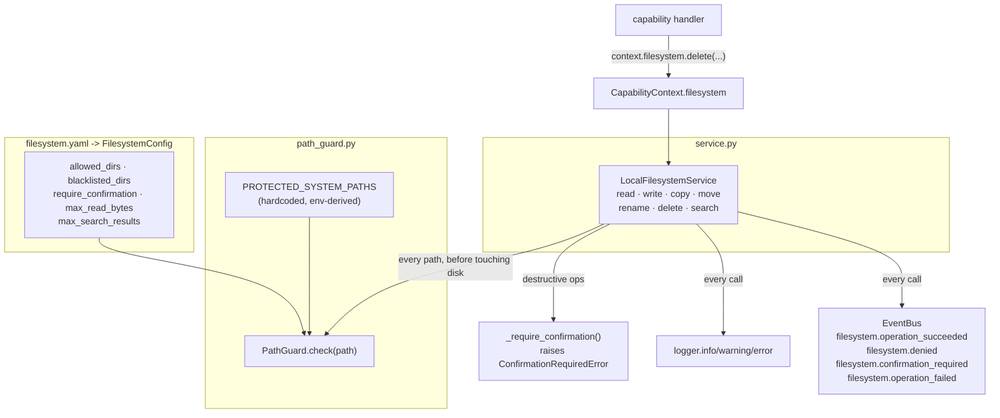

## What Phase 4 deliberately does not include

- No capability/intents registered in `CapabilityRegistry` for
  filesystem operations — this phase builds the module plugins and the
  orchestrator can use, not a "files" plugin with intents like "delete
  this file" wired up. That's for whichever phase adds one.
- No interactive confirmation UX — `confirmed=True` is a parameter a
  caller supplies; there is no built-in prompt (see above).
- No permission-scope integration with `PermissionsConfig` — a plugin
  calling `context.filesystem.delete(...)` is only checked against
  `PathGuard`, not against `PermissionsConfig.is_allowed(plugin,
  "filesystem.write")`. Wiring those together (so a plugin denied the
  `filesystem.write` scope can't call `write()` even on an allowlisted
  path) is future work, not implemented here.
- No symlink resolution hardening beyond what's tested — `search()`
  defensively re-checks every match through `PathGuard` (catching a
  symlink pointing outside the allowed tree), but `read`/`write`/etc.
  do not independently detect "this path is a symlink to somewhere
  denied" beyond what `Path.resolve()` already does by following
  symlinks during normalization.
- No quota/disk-space enforcement — `max_read_bytes` bounds a single
  read; nothing bounds total disk usage from repeated writes.
- No audit trail beyond the application log — operations are logged
  and published as events, but there's no separate persisted audit
  record (e.g. a dedicated SQLite table) of "what got deleted and
  when." That's a natural fit for the memory/database work in a later
  phase, not this one.

---

# Phase 5 — Voice Support (Interfaces Only)

Phase 5 was explicitly scoped to interface design: "Design the
interfaces only. No wake word yet." It adds `src/jarvis/core/voice/` —
Protocols for every stage of a Microphone -> Speech-to-Text ->
Assistant -> Text-to-Speech pipeline, an abstract `VoicePipeline`
contract coordinating them, and a `listening` section in `voice.yaml`
— with **no concrete implementation backed by a real microphone,
Whisper.cpp, or Piper**, and nothing in `main.py` or the orchestrator
referencing this package yet. This mirrors exactly how Phase 3 shipped
`voice.yaml`'s `stt`/`tts` schema years before either engine exists,
and how Phase 4's `PermissionsConfig.is_allowed()` was defined before
anything calls it.

| Requirement | How it's addressed at the interface level |
|---|---|
| Microphone | `MicrophonePort` (start/stop/read/is_active) |
| Speech-to-text | `SpeechToTextPort` (transcribe) |
| Assistant | `AssistantHandler` — a callable Protocol, not a direct Orchestrator dependency (see below) |
| Text-to-speech | `TextToSpeechPort` (synthesize) + `AudioPlayerPort` (play/stop/is_playing) |
| Continuous listening | `ListeningConfig.mode = CONTINUOUS`; `VoicePipeline.start()`'s documented contract to use `VoiceActivityDetector` for utterance segmentation |
| Push-to-talk | `ListeningConfig.mode = PUSH_TO_TALK`; `VoicePipeline.push_to_talk_press()`/`push_to_talk_release()` |
| Voice interruption | `VoicePipeline.interrupt()` (its own abstract method — see below) + `ListeningConfig.allow_interruption` |
| Conversation mode | `ListeningConfig.conversation_mode` / `conversation_timeout_seconds`, a documented modifier of `start()`'s post-response behavior |
| Background listening | `ListeningConfig.background`, a documented modifier of whether `start()` blocks its caller |

## Why ports.py is Protocols with Null defaults, but pipeline.py is an ABC

This phase reuses two different shapes already established in the
codebase, applied to the pieces they actually fit:

- **`ports.py`** (`MicrophonePort`, `VoiceActivityDetector`,
  `SpeechToTextPort`, `TextToSpeechPort`, `AudioPlayerPort`) are
  `Protocol`s with Null Object defaults — the exact shape
  `MemoryPort`/`AutomationPort` used in Phase 2 and `FilesystemPort`'s
  `Protocol` (though not its Null default — Phase 4's implementation is
  real) used in Phase 4. Each wraps one external resource with no
  internal state worth sharing across implementations, so a stateless
  structural interface plus a "no backend configured" default is the
  right fit.
- **`pipeline.py`**'s `VoicePipeline` is an `ABC`, the same shape
  `PluginBase` used in Phase 1: a concrete constructor that validates
  and stores dependencies, concrete shared behavior (`state` property,
  `_set_state()`, `_publish()`), and `@abstractmethod`s for what a real
  implementation must still provide. `VoicePipeline` is stateful (it
  has a lifecycle: idle -> listening -> speaking -> ...) in a way a
  single-method port like `MicrophonePort` isn't, so it needs the
  "shared base behavior + implementation slots" shape an ABC gives,
  not a Protocol's pure structural contract.

## Why `AssistantHandler` is a callable Protocol, not a dependency on `Orchestrator`

`core/voice/` is core-layer infrastructure, like `core/filesystem/`
and `core/config/` — and the established dependency direction (stated
explicitly in Phase 2's docs) is that `orchestrator/` depends on
`core/`, never the reverse. If `VoicePipeline` imported
`jarvis.orchestrator.orchestrator.Orchestrator` directly, that
direction would invert. `AssistantHandler` is therefore a plain
callable Protocol (`(text: str, session_id: str) -> str`) — whatever
eventually constructs a real `VoicePipeline` (in `main.py`, the one
module allowed to know every concrete type) supplies something
equivalent to:

```python
lambda text, session_id: orchestrator.handle(
    Request(text=text, session_id=session_id, source="voice")
).text or ""
```

without `core/voice/` ever importing `Request` or `Orchestrator`
itself.

## Why four of the five behaviors are config, and interruption is a method

`continuous listening`, `push-to-talk`, `conversation mode`, and
`background listening` all answer the same kind of question: *how
should `start()` behave?* Modeling each as a field on
`ListeningConfig` (`mode`, `conversation_mode` +
`conversation_timeout_seconds`, `background`) rather than as four
separate abstract methods keeps `VoicePipeline`'s method surface small
and keeps the "how do I turn on background continuous conversation
mode" question answerable by editing one YAML file instead of learning
four different method combinations.

Voice interruption is different in kind, not just degree: it isn't a
variant of how listening starts, it's an action that can happen *during*
`SPEAKING`, triggered from a different call path entirely (a real
implementation's `VoiceActivityDetector` firing on a background
thread while `AudioPlayerPort.is_playing` is `True`). That's why
`interrupt()` is its own `@abstractmethod` rather than a config flag —
`allow_interruption` in config controls *whether* it's allowed to do
anything; the method itself is what actually does it.

## State machine

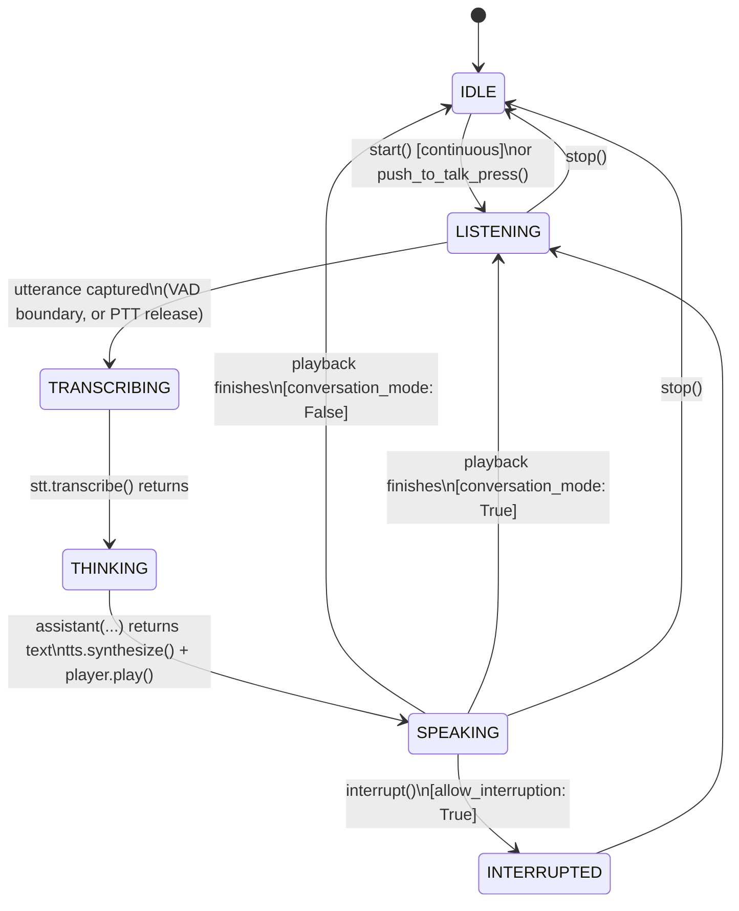

## Pipeline / dependency diagram

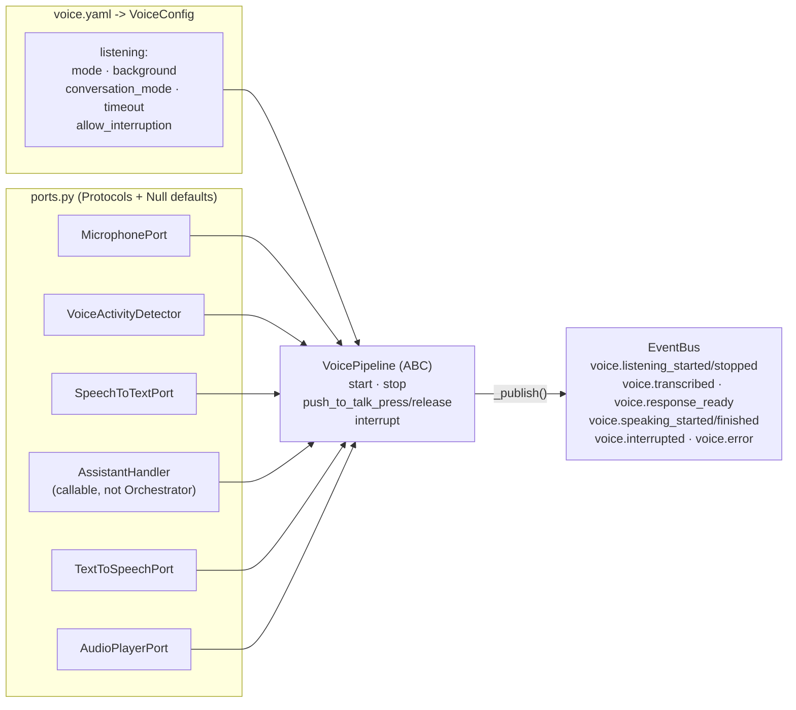

## What Phase 5 deliberately does not include

- **No concrete `VoicePipeline` implementation** — no subclass exists
  that actually runs a listen/transcribe/respond/speak loop, on a
  thread or otherwise. `tests/core/voice/test_pipeline.py`'s
  `MinimalVoicePipeline` exists only to prove the ABC's contract is
  implementable (the same role `test_plugin_base.py`'s `Valid` class
  plays for `PluginBase`) — it is test-only, not a shipped feature.
- **No real microphone, Whisper.cpp, or Piper integration** — no
  `pyaudio`/`sounddevice`, no subprocess or binding calls, no model
  loading. `requirements.txt` gained no new dependency this phase.
- **No wake word** — explicitly out of scope per this phase's
  instructions. `voice.yaml`'s `wake_word` section (from Phase 3)
  remains reserved and unconsumed; `ListeningMode` has exactly two
  members (`PUSH_TO_TALK`, `CONTINUOUS`), deliberately no third
  `WAKE_WORD` member, since wake word is meant to be an independent
  gate layered on top of either mode later, not a third mode of its
  own (see `ListeningMode`'s docstring).
- **Not wired into `main.py` or the orchestrator** — no
  `container.register_instance(MicrophonePort, ...)`, no
  `VoicePipeline` construction, no new `Request.source == "voice"`
  entry point. `core/voice/` is fully self-contained and importable in
  isolation, exactly like `voice.yaml`'s schema was in Phase 3.
- **No audio format conversion/resampling logic** — `AudioChunk`
  carries its own `sample_rate`/`channels`/`sample_width` specifically
  because a microphone backend and a TTS backend won't necessarily
  agree on format, but nothing here performs the actual conversion;
  that's a concrete `VoicePipeline`'s job.
- **No streaming/partial transcription** — `TranscriptionResult.is_final`
  and `.confidence` are modeled so a future streaming-capable STT
  backend can be a drop-in `SpeechToTextPort`, but `SpeechToTextPort`
  itself is a single-shot `transcribe(audio) -> TranscriptionResult`
  call, matching Whisper.cpp's batch-oriented design.
  *(Superseded by Phase 6: `SpeechToTextPort` is still single-shot, but
  `core/speech/streaming.py`'s `StreamingTranscriber` now calls it
  repeatedly on a growing buffer to produce real partial results — see
  below.)*

---

# Phase 6 — Whisper.cpp Integration (Reusable Speech Module)

Phase 6 adds `src/jarvis/core/speech/`: the first *real* implementation
of Phase 5's `SpeechToTextPort`/`VoiceActivityDetector` interfaces, and
a new, reusable `StreamingTranscriber` that turns single-shot
transcription into a real-time pipeline — buffering audio, detecting
speaker pauses, emitting low-latency partial results, handling
timeouts, and enforcing automatic language detection. Like every phase
touching `core/voice/`, it is **not wired into `main.py` or the
orchestrator** — this is a reusable module, not an activated feature.

Before writing any code, three trade-offs were surfaced and the first
two were resolved by explicit user choice (recorded here for anyone
revisiting this decision):

## Decision 1: how to call whisper.cpp

Three options were considered:

| Option | Model stays loaded? | New dependency | Verdict |
|---|---|---|---|
| **pywhispercpp bindings (chosen)** | Yes, in-process | A compiled pip package | Fast repeated calls, no process to manage |
| `whisper-server` subprocess + HTTP | Yes, in a child process | None beyond a whisper.cpp build | Adds subprocess lifecycle management (start/health-check/restart/stop) as a new failure mode |
| CLI subprocess per utterance | No — reloads from disk every call | None beyond a whisper.cpp build | Model reload (often 1-2s+) before every transcription — incompatible with "real-time" |

The CLI-per-utterance approach was ruled out outright: "real-time"
and "streaming" both require sub-second turnaround, and reloading a
whisper.cpp model from disk on every call cannot deliver that
regardless of how the rest of the pipeline is built. Between the
remaining two, pywhispercpp was chosen because it keeps the model
resident in memory without Jarvis having to supervise a second
process's lifecycle — `WhisperCppSpeechToText` is just a Python object
whose `_model` attribute is lazily populated once and reused, with no
port to bind, no health check to poll, and no crash-recovery logic to
write.

## Decision 2: scope — speech module only, no microphone backend

Real-time transcription needs *some* live audio source to be
meaningfully real-time, which raised the question of whether this
phase should also implement a real `MicrophonePort` (e.g. via
`sounddevice`). Scoped to the speech module only: `WhisperCppSpeechToText`
and `StreamingTranscriber` operate purely on `AudioChunk`s, sourced
from wherever — a real microphone, a WAV file, or (as in every test
here) a fake. This is both the more literal reading of "integrate
Whisper.cpp" and "produce a reusable speech module," and it avoids
taking on a second new compiled dependency plus real device I/O
(untestable in most sandboxed environments) in the same phase as the
whisper.cpp integration itself. `MicrophonePort` remains exactly where
Phase 5 left it — an interface with a Null default.

## Decision 3 (proposed, not re-confirmed separately): noise filtering via WebRTC VAD

"Noise filtering" and "speaker pause detection" turn out to be the
same job: a classifier that tells speech apart from everything else
(silence *and* background noise), called once per audio frame.
Rather than building a separate denoising DSP stage, `WebRtcVoiceActivityDetector`
(`core/speech/vad.py`) uses `webrtcvad` — a lightweight, purpose-built
speech/non-speech classifier (not a naive volume threshold) that is
the de facto standard for exactly this job in real-time voice
applications. A heavier spectral denoising library (e.g. `noisereduce`,
RNNoise) was considered and rejected: it solves a different problem
(cleaning up a recording for later use) at a much higher dependency
and latency cost than what "is this frame speech" needs.

## Why every optional dependency is imported lazily

`pywhispercpp`, `webrtcvad`, and `numpy` are never imported at module
load time anywhere in `core/speech/` — only inside the method that
actually needs them (`WhisperCppSpeechToText._ensure_model()`,
`WebRtcVoiceActivityDetector._ensure_vad()`,
`speech.audio.pcm16_bytes_to_float32()`). This means:

- `import jarvis.core.speech` always succeeds, with or without the
  `voice` extra installed — consistent with every other optional
  backend in this project (`NullMemoryPort`, `NullAutomationPort`, the
  Null voice ports from Phase 5).
- The failure mode when a dependency truly is missing is a specific,
  actionable `SpeechBackendUnavailableError` ("install the 'voice'
  extra"), not an `ImportError` surfacing from deep inside an unrelated
  call stack.
- `StreamingTranscriber` itself has **zero** dependencies beyond the
  standard library and `core/voice/`'s plain types — its entire test
  suite (`tests/core/speech/test_streaming.py`) runs against fakes with
  none of `pywhispercpp`/`webrtcvad`/`numpy` installed, which is what
  makes it genuinely reusable and testable independent of whether a
  real backend is present on the machine running it.

## Why most timeouts are audio-duration-based, not wall-clock

`StreamingTranscriber` computes `pause_duration_seconds`,
`max_utterance_seconds`, `no_speech_timeout_seconds`, and
`partial_interval_seconds` entirely from the *duration of the audio
it's been fed* (`speech.audio.chunk_duration_seconds`), never from
`time.monotonic()`/wall-clock elapsed time between `feed()` calls.
Two reasons, not one:

1. **Determinism and speed in tests.** The whole state machine becomes
   a pure function of its inputs — `tests/core/speech/test_streaming.py`
   feeds synthetic chunks and asserts transitions with no `time.sleep`
   or time-mocking anywhere, and the suite runs in about a second.
2. **Correctness.** "How long has the speaker been silent" should mean
   silence *in the recording*, not however long Python happened to
   take between two `feed()` calls — which could be skewed by GC
   pauses, scheduling, or a slow VAD call, none of which have anything
   to do with the actual audio content.

The one deliberate exception is `inference_timeout_seconds`, which
bounds the whisper.cpp call itself — genuinely wall-clock time, since
inference duration has no relationship to the audio's length. Python
cannot forcibly interrupt a blocking native call, so
`_transcribe_with_timeout()` runs it in a single-worker
`ThreadPoolExecutor` and calls `future.result(timeout=...)`; on
timeout, the call is *abandoned*, not killed — the worker thread keeps
running to completion in the background and its result is discarded.
This is a correct, if imperfect, way to enforce a deadline on
un-interruptible native code, and it's called out explicitly rather
than left implicit, since "timeout" could otherwise be misread as
"the call actually stops."

## Automatic language detection

`SpeechToTextConfig.language: "auto"` is the entire mechanism —
`WhisperCppSpeechToText` passes `language=None` to whisper.cpp when
`"auto"` is configured, which triggers whisper.cpp's own language-ID
head instead of forcing a fixed language. No new code was needed
beyond honoring the existing (Phase 3) config field's already-untyped
string value; `SpeechToTextConfig.language` was never restricted to a
fixed set of language codes, so `"auto"` was always a legal value —
this phase is what gives it meaning.

## State machine (StreamingTranscriber)

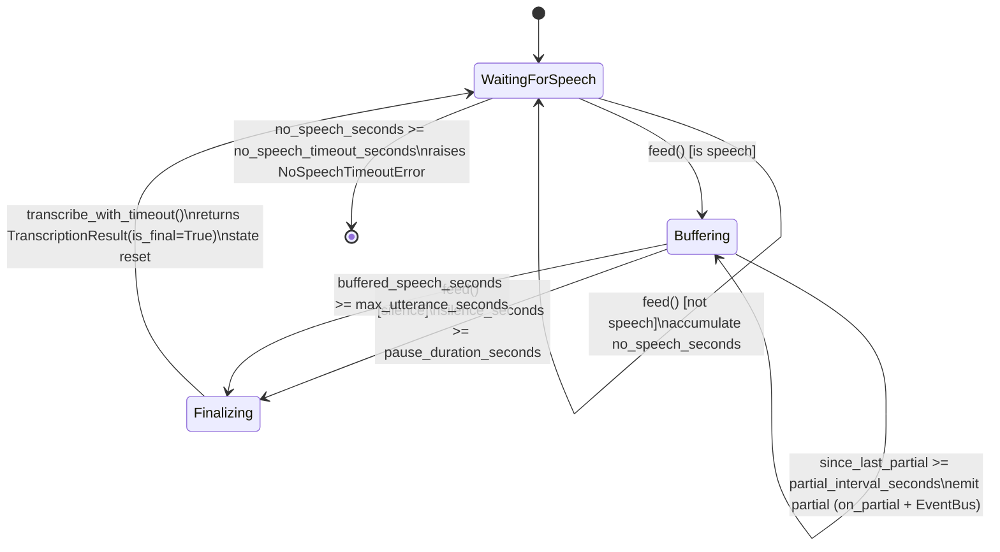

## Component / dependency diagram

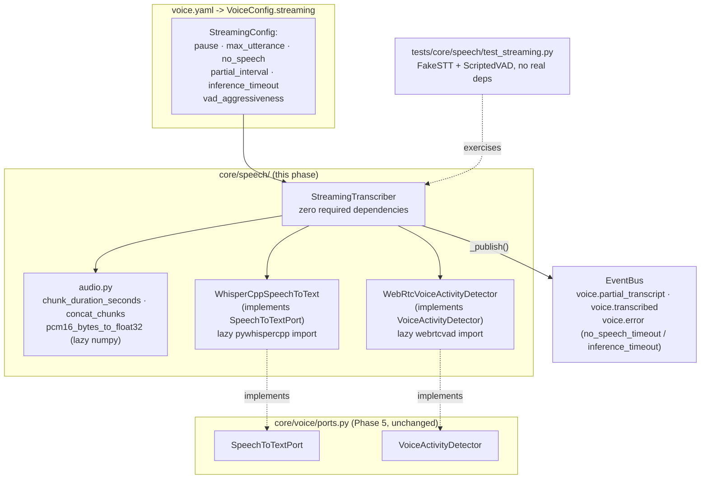

## What Phase 6 deliberately does not include

- **No real microphone backend** — see Decision 2 above.
  `MicrophonePort` is untouched from Phase 5.
- **Not wired into `main.py` or the orchestrator** — no
  `container.register_instance(SpeechToTextPort, WhisperCppSpeechToText(...))`,
  no `StreamingTranscriber` construction anywhere outside tests and the
  manual demo in this phase's verification. `core/speech/` is fully
  self-contained and importable in isolation.
- **No `VoicePipeline` subclass** — Phase 5's `VoicePipeline` ABC still
  has no concrete implementation. `StreamingTranscriber` is a building
  block a future `VoicePipeline` subclass would use internally, not a
  `VoicePipeline` itself (it has no concept of push-to-talk, TTS
  playback, or interruption — only listening/transcribing).
  `AssistantHandler` from Phase 5 remains unused as well.
  Wiring a `StreamingTranscriber` into a `VoicePipeline`'s CONTINUOUS
  mode is deferred to the phase that finally implements one.
- **No audio resampling** — `WhisperCppSpeechToText.transcribe()` and
  `WebRtcVoiceActivityDetector.is_speech()` both validate their input
  format (16kHz mono 16-bit PCM for whisper.cpp; one of
  8/16/32/48kHz mono 16-bit for webrtcvad) and raise a clear error on
  mismatch rather than silently resampling. Producing audio in the
  right format is a `MicrophonePort` implementation's job, not this
  module's.
- **No calibrated confidence scores** — `WhisperCppSpeechToText` always
  returns `confidence=None`; whisper.cpp/pywhispercpp does not expose a
  reliable per-segment confidence through the simple `transcribe()`
  call used here.
- **No wake word** — unchanged from Phase 5; still out of scope.
- **No model download/management** — `SpeechToTextConfig.model_path`
  must point at a ggml model file the user has already obtained;
  Jarvis does not fetch, verify, or manage model files.
- **`requirements-voice.txt`/the `voice` extra are new, unexercised
  install paths in this sandbox** — `pywhispercpp` and `webrtcvad`
  are not installed here (no wheel-availability or build-toolchain
  guarantee was verified for this specific environment), so their
  integration is tested at the boundary (`SpeechBackendUnavailableError`
  paths, format validation) via `tests/core/speech/test_vad.py` and
  `test_whisper_cpp.py`, with the real-library paths behind
  `pytest.importorskip` — genuine end-to-end transcription against a
  real model file is an integration test that has not been run as
  part of this phase, and should be the first thing verified on a
  machine with the `voice` extra and a model file actually installed.

---

# Phase 7 — Piper Integration (Reusable Speech Module, TTS Half)

Phase 7 is Phase 6's mirror image: a real `TextToSpeechPort`
implementation (`PiperTextToSpeech`, backed by `piper-tts`) and a new
reusable `SpeechQueue` that turns single-shot synthesis into
queueable, interruptible, volume-controlled playback. Like every
`core/voice/`-touching phase before it, **not wired into `main.py` or
the orchestrator** — a module other code can use, not yet an activated
feature.

Before writing code, the integration-approach question from Phase 6
was recognized as *already answered* by the same reasoning (Python
bindings over a subprocess, so the voice model stays resident — a
CLI-per-utterance Piper subprocess would reload a model on every
single response, same problem as whisper.cpp's CLI would have had).
The one genuinely new decision — whether to also build a real
audio-output backend — was raised explicitly and resolved by your
choice: **speech module only**, consistent with Phase 6's microphone
scoping.

| Requirement | How it's addressed |
|---|---|
| Natural voice output | `PiperTextToSpeech.synthesize()` — Piper itself; the model stays loaded across calls |
| Interruptible speech | `SpeechQueue.interrupt()` (stop current + drop pending) and `.skip()` (stop current, keep pending) |
| Queue multiple responses | `SpeechQueue.enqueue()` + a background worker thread; `max_queue_size` bounds it |
| Voice configuration | `voice.yaml`'s existing `tts.voice`/`tts.model_path`, unchanged from Phase 3 |
| Volume control | `SpeechQueue.set_volume()` — runtime, no resynthesis — via `speech.audio.apply_gain()` |
| Speech speed control | `TextToSpeechConfig.speed` — synthesis-time, mapped to Piper's `length_scale` |

## Why volume is a playback-time concern and speed is a synthesis-time one

These two requirements look similar ("control how the speech sounds")
but have fundamentally different mechanics in Piper, and the design
follows that difference rather than forcing both into the same shape:

- **Speed** changes *how Piper generates the audio* — its
  `length_scale` parameter stretches or compresses phoneme durations
  during synthesis. There is no way to speed up or slow down
  already-synthesized PCM without a real time-stretching algorithm
  (which would need to resample and interpolate, a much heavier
  operation than this phase's scope). So `TextToSpeechConfig.speed` is
  necessarily a *configured default*, consumed once by
  `PiperTextToSpeech._syn_config()` — changing it takes effect on the
  next `synthesize()` call, not on audio already in the queue.
- **Volume** is nothing more than scaling PCM sample amplitude —
  `speech.audio.apply_gain()` is pure integer arithmetic with
  clamping, needs no synthesis, and is cheap enough to apply to every
  item as `SpeechQueue` dequeues it. This is why `PiperTextToSpeech`
  itself never applies volume (`synthesize()` always returns audio at
  Piper's natural level) — volume lives entirely in `SpeechQueue`,
  where `set_volume()` can change it live, affecting every future
  dequeue (including items already sitting in the pending queue)
  without resynthesizing anything.

## Why `apply_gain` uses the standard library, not numpy

`speech.audio.pcm16_bytes_to_float32` (Phase 6) needs numpy — it
converts to the specific float32 format whisper.cpp's bindings expect.
`apply_gain` has no such external contract to satisfy; it only needs
to multiply 16-bit integers and clamp the result, which the standard
library's `array` module does natively. Using it instead of numpy
keeps `SpeechQueue`'s core logic exactly as dependency-free as
`StreamingTranscriber`'s: `tests/core/speech/test_queue.py`'s entire
suite runs with none of `piper-tts`/`webrtcvad`/`pywhispercpp`/numpy
installed, exercising real (if fake-backed) threading, timing, and
gain-scaling logic.

Clamping specifically (not just multiplying) matters: without it, a
gain that pushes a sample past `+32767` wraps around to a large
*negative* value (16-bit signed integer overflow), which sounds like
a sharp crackle/pop rather than the duller, expected sound of
clipping. `test_apply_gain_clamps_instead_of_wrapping_around` asserts
this directly.

## Why three interruption methods, not one

`skip()`, `clear()`, and `interrupt()` answer three different
questions a caller might have, and conflating them into one method
with flags would hide which question is actually being asked:

- *"Not that one — but say the rest"* → `skip()` (stop current only)
- *"Don't say anything else I've queued — but let this sentence
  finish"* → `clear()` (drop pending only)
- *"Stop talking entirely, right now"* → `interrupt()` (both) — this
  is specifically what a future `VoicePipeline.interrupt()`
  (barge-in, from Phase 5's abstract contract) would call when its
  `VoiceActivityDetector` detects the user speaking over the
  assistant.

## Why polling `is_playing` instead of extending `AudioPlayerPort`

`SpeechQueue`'s worker thread needs to know when playback finishes to
advance to the next queued item. The alternative to polling would be
adding an `on_finished` completion callback to `AudioPlayerPort.play()`
— but that changes a Phase 5 Protocol every future (and any
hypothetical third-party) implementation would need to support,
for a problem polling already solves adequately: config's
`queue.poll_interval_seconds` (default 50ms) bounds the worst-case
delay between playback actually finishing and `SpeechQueue` noticing.
Given `AudioPlayerPort.play()` is already required not to block, and
this is the *first* place in the project `stop()`/`is_playing` get
called from a different thread than `play()`, that contract is now
stated explicitly in `AudioPlayerPort`'s own docstring rather than
left implicit.

## Sequence diagram

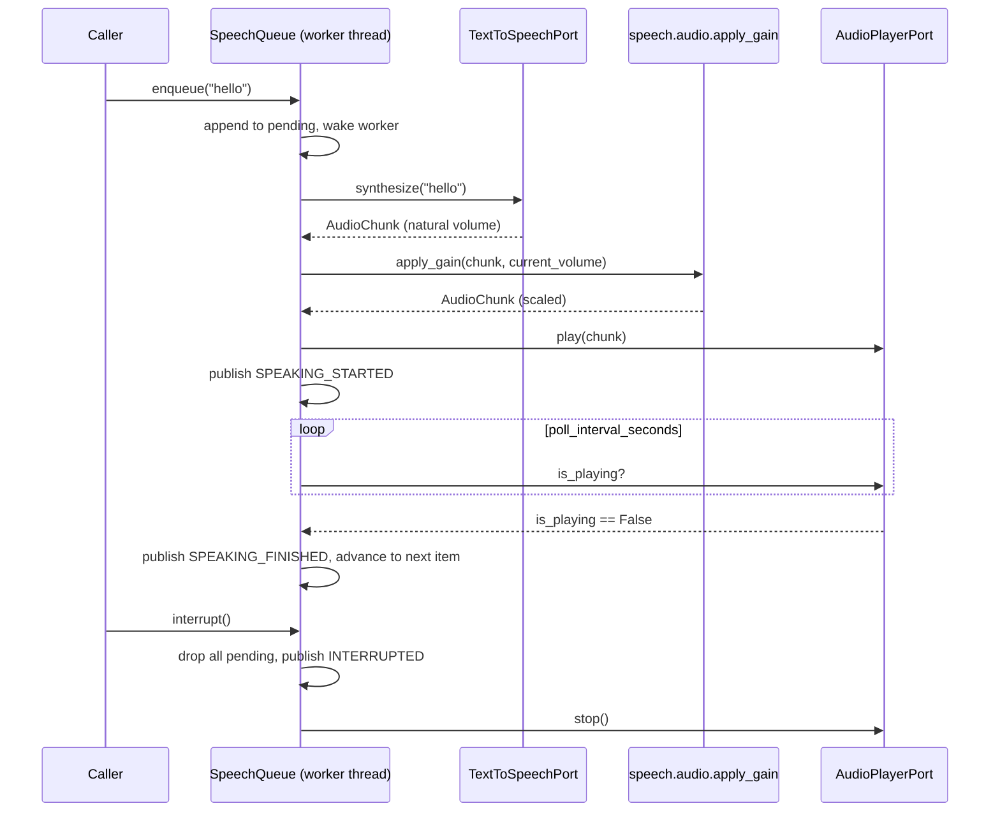

## What Phase 7 deliberately does not include

- **No real audio-output backend** — see the resolved trade-off above.
  `AudioPlayerPort` is untouched from Phase 5 (`NullAudioPlayerPort`
  remains the default); `tests/core/speech/test_queue.py` exercises
  `SpeechQueue` entirely against `FakeAudioPlayerPort` (a timer-based
  simulation, not a real device).
- **Not wired into `main.py` or the orchestrator** — no
  `container.register_instance(TextToSpeechPort, PiperTextToSpeech(...))`,
  no `SpeechQueue` construction anywhere outside tests and this
  phase's manual verification demo.
- **No `VoicePipeline` subclass** — `SpeechQueue` is a building block a
  future concrete `VoicePipeline` would use for its SPEAKING state, the
  same relationship `StreamingTranscriber` has to LISTENING. Neither
  has been wired into one.
- **No live speed changes** — `TextToSpeechConfig.speed` is a
  configured default; changing it requires reconstructing
  `PiperTextToSpeech` (or reloading its config), not a `SpeechQueue`
  runtime call. Volume, by contrast, is fully live via `set_volume()`.
  See the rationale above for why these aren't symmetric.
- **No cross-fade or ducking** — `skip()`/`interrupt()` call
  `player.stop()`, an immediate hard stop, not a fade-out. Natural
  playback stopping is left to whatever real `AudioPlayerPort` a
  later phase builds.
- **`piper-tts`'s exact API is unverified in this sandbox** — same
  caveat as Phase 6's `pywhispercpp`: implemented against the
  documented 1.x shape (`PiperVoice.load()`, `voice.synthesize(text,
  syn_config=SynthesisConfig(...))` yielding chunks with
  `audio_int16_bytes`/`sample_rate`), but not run against a real
  installed copy here. Verify against the installed version before
  relying on it in production.

# Phase 8 — Wake Word Support (OpenWakeWord)

Phase 8 adds the sixth real speech backend, `OpenWakeWordDetector`
(`core/speech/wake_word.py`), implementing a new `WakeWordPort`
Protocol, and — unlike Phases 6-7 — reaches into `core/voice/pipeline.py`
itself: `VoicePipeline`'s constructor and `start()`/conversation-mode
contract are extended so wake-word gating has a defined place in the
five-styles-of-listening design from Phase 5, even though no concrete
`VoicePipeline` subclass exists yet to actually run it.

The integration-approach question (Python bindings, resident model,
lazy-imported) and the "no real microphone backend" scope both carried
over unchanged from Phase 6/7's precedent — nothing new to resolve
there. The one requirement genuinely new to this phase — "supports
custom wake words" — was resolved as a design call rather than a fork
needing your input: `wake_word.models` became a *list*, since
openWakeWord natively loads and scores several models (built-in names
or custom `.onnx`/`.tflite` paths) simultaneously, and a list is a
strict superset of "one configurable word" at no extra cost.

| Requirement | How it's addressed |
|---|---|
| Runs continuously | `WakeWordPort.process()` is designed to be fed a live audio stream chunk-by-chunk indefinitely, the same shape as Phase 5's `VoiceActivityDetector` |
| Consumes minimal CPU | openWakeWord's ONNX models are purpose-built for always-on inference — orders of magnitude cheaper per chunk than running VAD-segmented STT continuously; `VoicePipeline.start()`'s contract now says explicitly that the expensive stages must stay off until a wake word fires |
| Supports custom wake words | `WakeWordConfig.models: list[str]` — built-in names and/or paths to custom-trained models, scored simultaneously |
| Can be enabled or disabled | `WakeWordConfig.enabled` (already existed since Phase 5; now actually consulted by `VoicePipeline`'s contract) |
| Integrates with the voice pipeline | `VoicePipeline.__init__` gains a required `wake_word: WakeWordPort` dependency; a new `VoiceState.WAITING_FOR_WAKE_WORD` and `VoiceEvents.WAKE_WORD_DETECTED` are wired into `start()`'s documented contract |
| Automatically resumes after conversations | `VoicePipeline`'s class docstring now specifies: whenever an implementation would return to IDLE after a turn ends, it must return to WAITING_FOR_WAKE_WORD instead if wake word is enabled, after calling `wake_word.reset()` |

## Why cooldown is measured in audio seconds, not wall-clock

Every duration-sensitive component in the speech module —
`StreamingTranscriber`'s pause/timeout logic (Phase 6), and now
`OpenWakeWordDetector.process()`'s `cooldown_seconds` — is a function
of how much audio has actually been *fed*, via
`speech.audio.chunk_duration_seconds`, not of wall-clock time between
calls. `OpenWakeWordDetector` follows the same rule: after a
detection, each model name is given a countdown (starting at
`config.wake_word.cooldown_seconds`) that is decremented by each
subsequent chunk's own duration, not by `time.monotonic()` deltas. This
keeps `tests/core/speech/test_wake_word.py`'s cooldown tests
deterministic and instant (feeding synthetic chunks, no real sleeping)
and correct for the same reason it was correct in Phase 6: "how long
ago did this fire" should mean audio-time, immune to scheduling jitter
between `process()` calls.

## Why wake word gating changed `VoicePipeline`'s contract (unlike Phases 6-7)

Phases 6 and 7 added real backends that plug into ports Phase 5 already
defined (`SpeechToTextPort`, `TextToSpeechPort`) — `VoicePipeline`
itself didn't need to change, because "what a transcriber/synthesizer
does" was already fully described. Wake word detection is different:
it's not a drop-in replacement for an existing pipeline stage, it's a
new *gate* that sits in front of the existing CONTINUOUS-mode listen
loop and changes what "waiting to be activated" means. That required:

- A **new port**, `WakeWordPort`, because nothing in Phase 5's port set
  (Microphone/VAD/STT/TTS/AudioPlayer) has the right shape — VAD
  answers "is this chunk speech," not "does this stream of chunks
  contain a specific phrase," which needs cross-chunk buffering.
- A **new state**, `WAITING_FOR_WAKE_WORD`, because collapsing it into
  existing IDLE or LISTENING would lose information a real
  implementation (and anything observing `VoiceEvents`) needs: IDLE
  means "nothing is happening, no audio is being processed at all";
  LISTENING means "VAD/STT are actively running." WAITING_FOR_WAKE_WORD
  is a third, distinct thing — audio *is* flowing, but only through the
  cheap classifier.
- A **required constructor argument**, `wake_word: WakeWordPort`, not
  an optional one — consistent with how `microphone`/`vad`/`stt`/etc.
  are already required and satisfied by `Null*Port` defaults when no
  real backend exists, rather than special-cased as optional.

No new *abstract method* was added, though: wake-word gating is a
config-driven modifier of `start()`'s existing behavior (mirroring how
continuous-vs-push-to-talk, background listening, and conversation mode
already work), not an independent action like `interrupt()` is.

## Sequence diagram

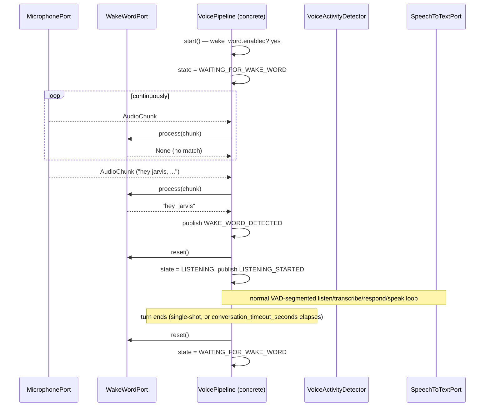

## What Phase 8 deliberately does not include

- **No real microphone backend** — same carried-over scoping as every
  prior voice phase; `NullMicrophonePort` remains the default.
- **Not wired into `main.py` or the orchestrator** — no
  `container.register_instance(WakeWordPort, OpenWakeWordDetector(...))`
  anywhere outside tests and this phase's manual verification demo.
- **No concrete `VoicePipeline` subclass** — `WAITING_FOR_WAKE_WORD`
  and the resume-after-conversation contract are specified on the ABC
  and exercised by a second test-only subclass
  (`WakeWordGatedVoicePipeline` in `tests/core/voice/test_pipeline.py`,
  alongside the existing `MinimalVoicePipeline`), not by a real
  implementation.
- **No per-model threshold or cooldown** — `threshold` and
  `cooldown_seconds` apply to every configured model uniformly. Custom
  wake words with meaningfully different false-accept rates would want
  per-model tuning; deferred as unrequested scope.
- **`openwakeword`'s exact API is unverified in this sandbox** — same
  caveat as every other real backend in this module: implemented
  against its documented shape (`Model(wakeword_models=...,
  inference_framework=...)`, `.predict()` returning a `{name: score}`
  dict, `.reset()`), not run against a real installed copy here. Verify
  against the installed version before relying on it in production.

# Phase 9 — The Cowork Integration Layer

Jarvis stops being a single-agent assistant here: local capability
handlers (Phase 2) still answer whatever they can, but anything they
can't is now offered to Claude Cowork — an external collaborative-
reasoning engine — for planning. The one requirement that shapes
everything else in this phase: **Cowork must never touch the operating
system.** Every other requirement (client, routing, structured
messages, response parsing, timeouts, retries, logging, diagnostics)
is infrastructure in service of that boundary.

| Requirement | How it's addressed |
|---|---|
| Receives requests from the voice pipeline | Unchanged — `Request.source="voice"` already flows into `Orchestrator.handle()` (Phase 2); Cowork routing is a new branch inside that same pipeline |
| Decides local vs. Cowork | `Orchestrator._try_cowork()`: only called when no local capability matched (`registration is None`) |
| Cowork performs planning | `CoworkClient.submit()` sends a `CoworkTaskRequest`, gets back a `CoworkTaskResponse` — a summary plus a list of proposed `CoworkPlanStep`s |
| Jarvis executes actions locally | `Orchestrator._try_cowork()` is the only code that calls `AutomationPort.execute()` for each step — Cowork's response models have no methods, only data |
| Cowork never touches the OS | Structural, not policy: `CoworkTaskResponse`/`CoworkPlanStep` (`core/cowork/models.py`) are plain pydantic values with zero behavior, and `core/cowork/` has no import of `orchestrator/` or any port capable of acting |
| Cowork client | `core/cowork/client.py`'s `CoworkClient`, and the transport it wraps, `core/cowork/http_transport.py`'s `HttpCoworkTransport` (lazy-imported `httpx`) |
| Request routing | `Orchestrator._try_cowork()` — see above |
| Structured task messages | `CoworkTaskRequest`/`CoworkTaskResponse`/`CoworkPlanStep`, all frozen pydantic models (`core/cowork/models.py`) |
| Response parser | `CoworkClient._parse_response()` — `CoworkTaskResponse.model_validate()`, wrapping `ValidationError` as `CoworkResponseError` |
| Timeout handling | `CoworkTransport.post_json(..., timeout=...)` must raise the built-in `TimeoutError`; `CoworkConfig.timeout_seconds` bounds each attempt |
| Retry logic | `CoworkClient.submit()`'s loop: `max_retries` extra attempts, exponential backoff (`retry_backoff_seconds * 2**n`), injectable `sleep` for deterministic tests |
| Logging | Every attempt, retry, and terminal outcome is logged; `EventBus` events (`cowork.request_started/retrying/succeeded/failed`, `cowork.routed`, `cowork.error`) give the same visibility every other phase's pipeline has |
| Diagnostics | `CoworkClient.last_diagnostics` — a `CoworkDiagnostics` value (attempts, latency, status, error) recorded after every `submit()` call |

## Why the OS-access boundary is structural, not a runtime check

A permission check ("reject this action if it came from Cowork") would
still require *something* in `core/cowork/` capable of describing an
arbitrary OS action, which is the exact capability this requirement
says Cowork must never have. Instead, `core/cowork/models.py` only
defines what Cowork's plan *step* can contain — `action_type` is a
closed `Literal["automation", "respond"]`, and `AutomationActionModel`
mirrors `orchestrator.ports.AutomationAction`'s existing, already-scoped
shape (`name` + `parameters`, run through `AutomationPort.execute()`,
same as any plugin-originated automation call). There is no
`filesystem`/`terminal`/`browser` action type yet: extending Cowork's
reach to those would mean adding a new step kind here and a
corresponding case in `Orchestrator._try_cowork()`, an explicit,
reviewable code change — not something Cowork can opt into via a
request. `core/cowork/` also has no import of `orchestrator/` at all
(the reverse is true, matching the Phase 2 dependency-direction rule),
so nothing in this module could reach `FilesystemPort` even by
accident.

## Why `CoworkTransport` is separate from `CoworkClient`

Every real backend added since Phase 6 (whisper.cpp, Piper,
openWakeWord) kept its actual third-party dependency behind a thin
seam so the *interesting* logic — buffering, queueing, cooldown — could
be tested with that dependency completely absent. `CoworkTransport`
plays the same role here: it's the only place `httpx` is imported, and
the only thing `CoworkClient`'s retry/timeout/parsing/diagnostics logic
depends on. `tests/core/cowork/test_client.py`'s entire suite —
including exponential backoff timing and malformed-response handling —
runs against a scripted fake transport, no network and no real sleeping
involved.

## Why routing is "no local match" rather than a confidence threshold

`CoworkConfig.min_confidence_for_local` exists in the config shape
(for a future refinement — offering *low-confidence* local matches to
Cowork too, not just total misses) but `Orchestrator._try_cowork()`
doesn't consult it yet: it only fires when `CapabilityRegistry` found
nothing at all. This keeps the routing decision unambiguous for this
phase (a request is either locally handled or it isn't) and avoids
capability handlers ever being silently second-guessed by Cowork,
which would be a much larger behavioral change than this phase asked
for.

## Sequence diagram

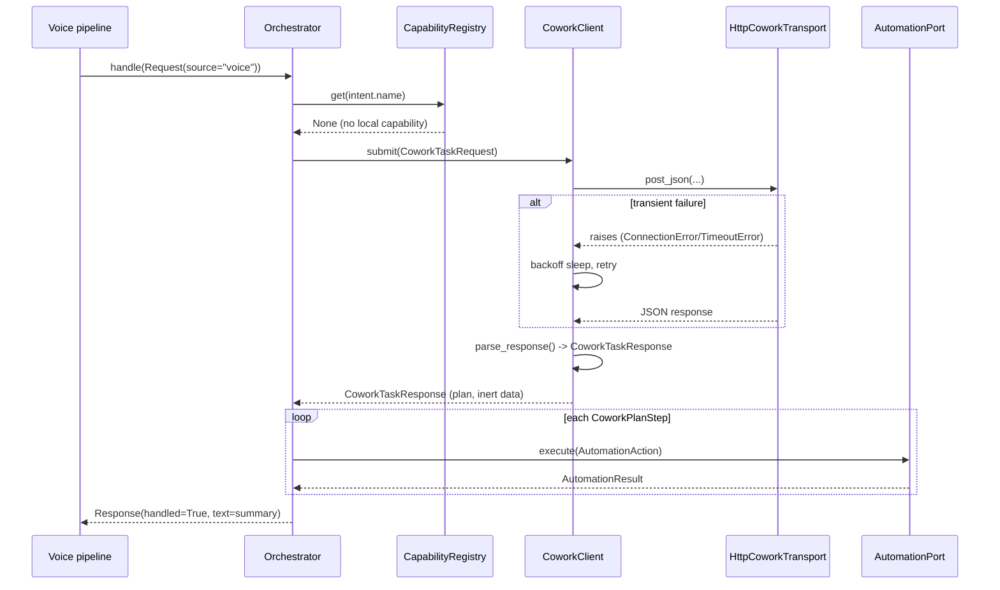

## What Phase 9 deliberately does not include

- **No real Cowork endpoint** — `HttpCoworkTransport`'s `base_url` is a
  placeholder; Cowork's actual HTTP contract (auth format, exact
  request/response envelope) is not published/verified in this
  environment, the same caveat every other real backend in this
  project carries. Verify before enabling in production.
- **Disabled by default** — `cowork.yaml`'s `enabled: false` means
  `main.bootstrap()` wires `NullCoworkClientPort` in, not
  `HttpCoworkTransport`; no outbound network call happens unless a
  deployment explicitly opts in.
- **Only `automation`/`respond` step types** — `filesystem`/`browser`/
  `terminal` step types are unrequested scope; extending
  `CoworkPlanStep`/`_try_cowork()` to them later follows the exact same
  pattern.
- **No confidence-threshold routing** — see above; `_try_cowork()` only
  fires on a total capability-registry miss.
- **No streaming/partial Cowork responses** — `submit()` is a single
  blocking round trip per task, matching every other Phase 6-8 backend
  call's shape (whisper.cpp's `transcribe()`, Piper's `synthesize()`).

# Phase 10 — The Internal Cowork Workspace (Specialist Collaborators)

Eight named collaborator roles — Architect, Planner, Coder, Researcher,
Memory Manager, Automation Engineer, Documentation Engineer, QA
Engineer — each a `CollaboratorSpec` (`core/cowork/collaborators.py`):
responsibilities, boundaries, and a reusable prompt template. A
collaborator is not a separate process; it's a role Cowork is asked to
reason *as* before Jarvis submits the task through the unchanged Phase
9 `CoworkClientPort` pipeline (retry/timeout/parsing/diagnostics all
still apply).

`CoworkWorkspace` (`core/cowork/workspace.py`) is the orchestration
piece: it picks a role (an explicit `request.metadata["role"]`, or a
keyword heuristic via `select_role()`), renders that role's prompt
template, and delegates to whatever `CoworkClientPort` it wraps.
Critically, `CoworkWorkspace` *implements* `CoworkClientPort` itself —
so `main.bootstrap()` just wraps the Phase 9 backend
(`CoworkClient`/`NullCoworkClientPort`) in one, and `Orchestrator`'s
constructor and `_try_cowork()` are unchanged from Phase 9. "Jarvis
orchestrates these collaborators" is exactly this: role selection is
Jarvis-owned code, not something Cowork decides for itself.

Every collaborator's output is a `CollaboratorOutput` wrapping the same
`CoworkPlanStep` list Phase 9 already defined — no collaborator gets a
new way to describe an action, and none has an `execute()` method.
"No collaborator may directly control the operating system" and "all
actions flow back through Jarvis" are the same structural guarantee
Phase 9 already built (`Orchestrator._try_cowork()` is still the only
code that calls `AutomationPort.execute()`); Phase 10 doesn't need a
new enforcement mechanism, only more roles feeding the existing one.

## What Phase 10 deliberately does not include

- **Role selection is keyword matching, not NLU** — good enough for
  "Jarvis decides," not a claim of intelligent routing; a request can
  also force a role via `metadata={"role": "coder"}`.
- **No inter-collaborator handoff** — one request routes to exactly one
  collaborator per `submit()` call; an Architect's output isn't
  automatically fed into a Planner call. Composing collaborators is
  left to whatever calls `CoworkWorkspace` repeatedly.
- **No real Cowork endpoint**, same caveat as Phase 9 — nothing here
  changes that.

# Phase 11 — The Full Voice Pipeline, Wired Together

`JarvisVoicePipeline` (`core/speech/jarvis_pipeline.py`) is the first
concrete `VoicePipeline` — every phase since 5 built one piece
(interfaces, whisper.cpp, Piper, wake word) without wiring them
together, waiting for this phase. It lives in `core/speech/`, not
`core/voice/`, because it imports `StreamingTranscriber`/`SpeechQueue`
(`core/speech/`, which depends on `core/voice/`) — putting it in
`core/voice/` would reverse that dependency.

Wake Word → Whisper.cpp → Intent Parser → Jarvis → Cowork → Jarvis →
Piper needed almost no new glue: "Intent Parser → Jarvis → Cowork →
Jarvis" is already `AssistantHandler`'s documented shape (Phase 5) —
`lambda text, sid: orchestrator.handle(...)`, and `Orchestrator`
already does intent recognition, local-vs-Cowork routing (Phase 9), and
collaborator selection (Phase 10). This pipeline only had to build the
Wake-Word→Whisper.cpp and Jarvis→Piper ends.

A single background thread (`_audio_loop`) reads the microphone
continuously and branches on `VoiceState`, extending Phase 8's
"always-on, cheap while idle" shape to every state, including SPEAKING
— barge-in detection and "has playback finished" detection happen in
the *same* loop iteration (`_tick_speaking`), which is what makes
conversation interruption possible without a second thread.

| Requirement | How it's addressed |
|---|---|
| Streaming conversations | `StreamingTranscriber` (Phase 6) unchanged; partial transcripts still flow via `voice.partial_transcript` |
| Conversation interruption | `_tick_speaking()` checks `vad.is_speech()` every loop iteration while SPEAKING; `_do_interrupt()` calls `SpeechQueue.interrupt()` and re-enters LISTENING immediately |
| Conversation history | Unchanged — `Orchestrator`'s `SessionStore` (Phase 2) already keys history off `session_id`, which the pipeline passes through unmodified per turn |
| Latency optimization | See below and `scripts/benchmark_voice_latency.py` |
| Conversation state | `VoiceState` (Phase 5/8) now has a real state machine driving it: IDLE/WAITING_FOR_WAKE_WORD/LISTENING/TRANSCRIBING/THINKING/SPEAKING/INTERRUPTED |
| Automatic follow-up handling | `conversation_mode`: after speaking finishes, `_finish_speaking()` re-enters LISTENING and arms a `conversation_timeout_seconds` timer instead of requiring a new wake word |
| "Feels natural" | No blocking waits anywhere in the turn-handling path — see below |

## Why `_on_utterance` doesn't block on speaking, and the bug that taught it

The first implementation had `_on_utterance()` block synchronously
until `SpeechQueue` finished playing, before returning control to the
audio loop. That serializes barge-in detection behind playback — the
same thread that would notice the user talking over the assistant was
asleep waiting for the assistant to finish talking, so barge-in could
never actually fire. Fixed by making `_on_utterance()` return as soon
as the response is enqueued; `_tick_speaking()` (called every loop
iteration regardless of whether a new chunk arrived) does both the
barge-in check and the "is playback done" check, so one thread serves
both without blocking on either. A second, related bug: detecting
"done speaking" only once `AudioPlayerPort.is_playing` had been
*observed* True first (not just False) — otherwise the brief window
between `enqueue()` and the queue's worker thread actually starting
playback reads as "already finished."

## Latency optimizations already in place, and where the floor is

Nothing in this phase invents a new optimization technique — it
composes ones already built: whisper.cpp/Piper stay resident (Phase
6/7, no reload-per-call cost), `StreamingTranscriber` emits partial
results instead of waiting for the full utterance, and interruption is
immediate rather than waiting for a natural pause. What *is* new is
measuring the result: `scripts/benchmark_voice_latency.py` drives
`JarvisVoicePipeline` with fakes carrying assumed STT/TTS delays (no
real backend is installed in this environment — see the script's own
caveat) and reports the gap between that assumed floor and actual
measured latency as Jarvis's own coordination overhead. Result as of
this phase: ~2ms overhead on a 230ms assumed STT+TTS floor — see
`docs/benchmarks/voice_latency.md`.

## What Phase 11 deliberately does not include

- **No real microphone/speaker backend** — same `Null*Port` defaults as
  every prior voice phase; `JarvisVoicePipeline` is fully exercised in
  tests via `QueueMicrophonePort`/`FakeAudioPlayerPort` test doubles.
- **Not wired into `main.py`** — nothing constructs a
  `JarvisVoicePipeline` outside tests/the benchmark script yet, since
  there's still no real audio I/O to run it against.
- **No cross-turn latency history/dashboard** — the benchmark script is
  run manually and writes one static report; no automatic regression
  tracking.

# Phase 12 — The Memory Manager Collaborator

`core/memory/` gives Jarvis a real, working long-term memory it calls
directly via a structured API (`MemoryManagerPort`) — separate from
`core/cowork/collaborators.py`'s `CollaboratorRole.MEMORY_MANAGER`
prompt spec (Phase 10), which only recommends what to remember; this
module is what actually does it. `SqliteMemoryManager` is a real
implementation (stdlib `sqlite3`, no new dependency, no Null default —
same "this phase delivers a working thing" precedent as Phase 4's
`LocalFilesystemService`).

| Requirement | How it's addressed |
|---|---|
| Maintain long-term memory | `SqliteMemoryManager` persists to a durable SQLite file across restarts |
| Retrieve relevant memories | `recall(MemoryQuery)` |
| Rank memory importance | `ranking.rank_records()` — importance + keyword overlap + recency decay, no embeddings |
| Summarize conversations | `summarize_session()` — deterministic/heuristic, not LLM-generated (see below) |
| Store useful knowledge | `store_knowledge()` — durable by default, unlike `remember_turn()` |
| Forget temporary information | `forget(temporary_only=True)` — the default; durable facts/summaries survive |
| Structured APIs | Every method is a typed Python method on `MemoryManagerPort`, not a prompt |
| No embeddings yet | `ranking.py` is pure importance/keyword/recency math |
| Interfaces for future semantic memory | `EmbeddingIndexPort` + `NullEmbeddingIndexPort` (ports.py) — unused, prepared |

`orchestrator/memory_adapter.py`'s `MemoryManagerAdapter` bridges
`core/memory/`'s own types to `orchestrator.ports.MemoryPort`'s
`Turn`/`MemoryItem` shape, keeping `core/` free of any dependency on
`orchestrator/` (the same rule `core/voice/`'s `AssistantHandler`
already follows). `main.bootstrap()` wires the real backend in only
when `memory.yaml`'s `long_term.enabled` is true, else `NullMemoryPort`
— same cautious-rollout pattern as voice/Cowork.

`summarize_session()` is deliberately not LLM-generated: it joins the
session's most recent remembered turns into a short string. A real
summarizer is future work for whichever phase connects this to
Cowork's Memory Manager collaborator role — this phase's job was a
working structured API, not language generation.

`temporary` (not `kind`) is what `forget()` keys on: conversation turns
default `temporary=True` (ephemeral working memory), while
`store_knowledge()`/`summarize_session()` default `temporary=False`
(durable) — this is what makes "maintain long-term memory" and "forget
temporary information" coexist without conflicting.

## What Phase 12 deliberately does not include

- **No embeddings** — explicit scope boundary; `ranking.py` never
  computes or compares vectors.
- **`EmbeddingIndexPort` has no real implementation** — `Null
  EmbeddingIndexPort` is the only one; nothing calls it yet either.
- **No wiring of `EmbeddingIndexPort` into `SqliteMemoryManager`** —
  adding it later means adding a 4th ranking term, not restructuring
  `recall()`.
- **Cowork's Memory Manager collaborator still doesn't call this
  module** — Phase 10's role recommends actions in prose; teaching
  Orchestrator to route those recommendations into
  `MemoryManagerPort` calls is unrequested scope for this phase.

# Phase 13 — The Obsidian Vault Connection

`core/vault/`'s `VaultService` turns an Obsidian vault into Jarvis's
permanent knowledge base: notes with YAML frontmatter, folder
organization (daily journals, project notes, conversation summaries,
dev logs), automatic `[[wikilink]]` backlinks, and version history with
rollback. It's a real implementation over the existing `FilesystemPort`
(Phase 4) — no new dependency (PyYAML is already a base one) and no
Null default, the same "this phase delivers a working thing" precedent
as `LocalFilesystemService`/`SqliteMemoryManager`.

| Requirement | How it's addressed |
|---|---|
| Read/write/update notes | `read_note()`/`write_note()`/`update_note()` — `write_note()` is an alias for `update_note()`, so both paths are always versioned |
| Daily journals | `append_to_daily_journal()` — creates today's note or appends to it |
| Project notes | `create_project_note()` |
| Automatic backlinks | `backlinks.py`'s `extract_links()`/`add_backlink()`, applied after every write |
| YAML frontmatter | `frontmatter.py`, PyYAML-backed |
| Folder organization | `VaultConfig`'s `daily_dir`/`projects_dir`/`conversations_dir`/`devlogs_dir` |
| Conversation summaries | `record_conversation_summary()` |
| Development logs | `record_devlog()` |
| Auto-capture important conversations | `record_conversation_summary()`'s `turn_count` gate (`min_turns_for_auto_capture`) |
| Never overwrite without version history | `_versioned_write()` — every overwrite snapshots first; there is no other write path |
| Rollback | `rollback_note()` — restores old content via the same versioned-write path, so a rollback is itself always reversible |

## Why backlinks needed a second bug fix, not just the obvious one

The first version applied backlinks by re-scanning a note's body for
`[[links]]` on every write and appending an entry to each target's
"## Backlinks" section. That immediately caused a real bug, caught by
running it rather than just reading it: a backlink entry (`- [[Foo]]`)
is itself a wikilink, so updating target B's body to add a backlink to
A made B's *own* next backlink scan see "B links to A" and write a
backlink back onto A — a spurious, symmetric backlink that shouldn't
exist (A linked to B; B never authored a link to A). Fixed by having
`extract_links()` stop scanning at the "## Backlinks" heading:
generated backlink entries are metadata, not authored content, and
must not themselves be treated as outgoing links.

A second, unrelated bug from the same live-testing pass: version and
backlink-search paths were computed with plain `str(Path)` (backslashes
on Windows) while `FilesystemPort.search()` returns POSIX-style
(forward-slash) paths — a substring match between the two silently
never matched, so backlinks silently never fired. Fixed by using
`Path.as_posix()` consistently wherever a resolved path is compared
against a search result.

## Why version history lives *inside* vault_dir, not beside it

`versions_dir` (`.jarvis/versions` by default) nests under `vault_dir`
rather than being a sibling of it, specifically so it stays inside the
same directory `filesystem.yaml`'s `allowed_dirs` already grants access
to (`vault` is allowlisted by default; the project root is not). This
was the first bug the live-testing pass caught: a sibling path resolved
outside every allowed directory and `PathGuard` correctly denied it.

## What Phase 13 deliberately does not include

- **Not wired into `Orchestrator`/`CapabilityContext`** — `VaultPort`
  is registered in the container (`main.bootstrap()`) for a future
  plugin/capability to resolve, but no capability handler calls it yet,
  and voice-pipeline conversations aren't auto-captured yet either
  (that wiring belongs to whichever phase gives `Orchestrator` a reason
  to call `record_conversation_summary()` after a session ends).
- **Backlink target resolution is a flat filename search** — `[[Foo]]`
  resolves to the first `Foo.md` found anywhere in the vault, not
  Obsidian's full path-disambiguation/alias rules. Fine for a vault
  with unique note names; a real edge case for one that isn't.
- **No note templates** — daily/project/devlog notes get a minimal
  fixed frontmatter shape, not the free-form Templater-style templates
  Obsidian itself supports.

# Phase 14 — Semantic Memory

Gives Phase 12's `EmbeddingIndexPort` (prepared, unimplemented) its
first real backend, indexes the Phase 13 vault into memory, and injects
the results into every Cowork request — "give Cowork only the relevant
memories instead of the entire vault."

| Requirement | How it's addressed |
|---|---|
| Index the entire vault | `VaultIndexer.index_vault()` — walks `VaultService.list_notes()`, stores each as a durable `MemoryRecord` and embeds it |
| Incremental updates | A content-hash-per-path JSON state file; unchanged notes are skipped after one hash comparison, no SQLite write or embedding computation |
| Embedding cache | `SemanticIndex.embed()` is content-addressed (SHA-256 of the text), so identical content anywhere is only ever embedded once |
| Hybrid keyword + semantic search | `HybridMemorySearch.search()` merges Phase 12's `recall()` (keyword/importance/recency) with `SemanticIndex.search()` (cosine similarity) |
| Ranking | Weighted sum of the two sources (`semantic_weight`), records found by both scoring highest |
| Memory citations | `MemoryCitation.citation` — the vault path a result came from (or `kind#id` for non-vault memories) |
| Context injection before every Cowork request | `CoworkWorkspace`'s new optional `context_provider` (Phase 10's class, extended) calls `relevant_memories()` and merges the result into `request.context["memories"]` before the collaborator prompt is rendered |

## Why a hashing embedding, not a real model

`HashingEmbeddingProvider` hashes tokens into fixed buckets (feature
hashing) rather than calling a trained embedding model — zero new
dependencies, deterministic, instant, no network/GPU. It captures
word-overlap similarity, not true synonym/semantic understanding — an
honest limitation, not a hidden one. `EmbeddingProvider` is a Protocol
specifically so a real model can be dropped in later (lazy-imported,
same pattern as every other real backend in this project) without
touching `SemanticIndex` or `HybridMemorySearch`.

## Why context injection didn't require core/cowork/ to depend on core/memory/

`CoworkContextProvider` (a `relevant_memories(instruction, limit) ->
list[dict]` Protocol) lives in `core/cowork/ports.py`, not
`core/memory/`. `HybridMemorySearch.relevant_memories()` satisfies it
structurally — same shape, no inheritance — so `CoworkWorkspace` can
depend on the Protocol without ever importing `core/memory/`, matching
this project's consistent "ports decouple sibling core/ packages" rule.
`main.bootstrap()` is the one place that knows both concrete types
exist and wires them together.

## Why `get_by_ids()` was added to `MemoryManagerPort`

`HybridMemorySearch` first built its record lookup purely from
`recall()`'s keyword candidates — until testing showed a semantic-only
hit (a record `SemanticIndex.search()` found that `recall()`'s smaller
keyword-ranked candidate set didn't include) had no `MemoryRecord` to
attach to its score, and was silently dropped. That quietly degraded
"hybrid" search into "keyword search with a semantic tiebreaker."
Fixed by adding `get_by_ids()` (Phase 12's port gained one new method)
so semantic-only hits are resolved directly instead of guessed at via a
wider keyword fetch.

## What Phase 14 deliberately does not include

- **Vault indexing runs once, synchronously, at startup** — no
  background watcher re-indexing on note changes; re-running
  `index_vault()` (e.g. from a future scheduled task) is cheap
  (incremental) but nothing currently triggers it automatically.
- **No real embedding model** — see above; swapping one in is scoped as
  a new `EmbeddingProvider` implementation, not a Phase 14 follow-up
  that needs to happen for this phase to be "done."
- **`VectorIndexConfig`/FAISS remain untouched and unused** — still
  reserved for later, as Phase 3 left them.
- **Linear-scan search** — appropriate for one vault's worth of notes,
  not a production-scale ANN index (see `semantic_index.py`'s module
  docstring).

# Phase 15 — The Desktop Execution Engine

`core/execution/`'s `ExecutionEngine` is where Claude Cowork-requested
actions actually run — the completion of Phase 9's boundary ("Cowork
proposes, Jarvis executes"). `Orchestrator._try_cowork()` (Phase 9) has
called `AutomationPort.execute()` for every `CoworkPlanStep` since
Phase 9; this phase is the first real `AutomationPort` behind it,
instead of `NullAutomationPort`.

| Requirement | How it's addressed |
|---|---|
| Filesystem | Reuses the existing `FilesystemPort` (Phase 4) directly — no new protocol |
| Terminal | `SubprocessTerminal` — stdlib `subprocess`, argv-list (`shell=False`), allowlisted executables only |
| Desktop automation | `PyAutoGuiDesktopAutomation` — lazy `pyautogui` ('desktop' extra) |
| Application management | `ProcessApplicationManager` — stdlib `subprocess`/`taskkill`/`pkill`, no new dependency |
| Clipboard | `PyperclipClipboard` — lazy `pyperclip` |
| Screenshots | `PillowScreenshotter` — lazy `PIL.ImageGrab` |
| Window management | `PyGetWindowManager` — lazy `pygetwindow` |
| Cowork may request actions | `orchestrator/execution_adapter.py`'s `ExecutionEngineAdapter` implements `AutomationPort`; `main.bootstrap()` wires it in when `execution.yaml`'s `enabled` is true |
| Validate permissions before execution | `ExecutionEngine.execute()` calls `PermissionsConfig.is_allowed()` (Phase 3, unenforced until now) before any dispatch |
| All actions logged | Every attempt is `logger.info`/`.warning`/`.exception`'d, and `EventBus` events (`execution.denied/succeeded/failed`) are published |
| Execution audit trail | `audit.py`'s `AuditTrail` — one JSON-Lines row per attempt, allowed or not, in `execution.yaml`'s `audit_log_path` |

## Two config files, one enforcement point

`execution.yaml` (`ExecutionConfig`, new) configures the engine's own
mechanics — which terminal executables exist at all, timeouts, where
the audit log lives. `permissions.yaml` (`PermissionsConfig`, Phase 3)
decides *who* may do *what*, via a `category.action -> scope` mapping
(`engine.py`'s `_SCOPES`) chosen to match the scope names
`permissions.example.yaml` already anticipated back in Phase 3
(`automation.mouse`, `automation.keyboard`, `filesystem.read`) rather
than inventing new ones. `is_allowed()` had zero callers until this
phase — `ExecutionEngine.execute()` is its first real enforcement
point, three phases after it was modeled.

## Why `AutomationAction.name` is a dotted string

`orchestrator.ports.AutomationAction` (Phase 2) already has exactly the
shape Cowork's plan steps need — `name` + `parameters` — so instead of
changing that type or `Orchestrator`, `ExecutionEngineAdapter` treats
`name` as `"category.action"` (e.g. `"filesystem.write"`,
`"desktop.click"`) and splits it. Zero changes to `Orchestrator`,
`CapabilityContext`, or any Phase 9/10 code were needed — the same
"implement the existing Protocol, don't change it" trick
`CoworkWorkspace` (Phase 10) and `MemoryManagerAdapter` (Phase 12) both
used.

## Why `execute()` never raises for a denial

A denied or failed action returns a `success=False` `ExecutionResult`
rather than raising — `Orchestrator._try_cowork()` loops over every
step in a Cowork plan, and one denied/failed step must not abort the
rest or crash the request. Exceptions are still used *within*
`execute()` (`ExecutionError` and its subclasses, caught internally),
but never escape it.

## What Phase 15 deliberately does not include

- **Desktop/clipboard/screenshot/window default to Null even when the
  engine is enabled** — `main.bootstrap()` always wires
  `NullDesktopAutomationPort`/`NullClipboardPort`/`NullScreenshotPort`/
  `NullWindowPort`, since those need the optional 'desktop' extra and
  real hardware access a given deployment may not have. Only
  filesystem/terminal/application are real by default.
- **`requested_by` is one fixed identity per `AutomationPort`
  instance** (`execution.yaml`'s `default_requester`, "cowork") — no
  per-request identity threading from deeper in the system yet.
- **No approval/confirmation flow beyond `FilesystemPort`'s own** —
  `require_confirmation` (filesystem.yaml) still gates destructive
  filesystem ops exactly as it did in Phase 4; nothing new was added
  for terminal/desktop/application actions.

# Phase 16 — The Browser Agent

`core/browser/`'s `PlaywrightBrowser` becomes `ExecutionEngine`'s
eighth category (`browser`), backed by Playwright, lazily imported.
"Claude Cowork should request browser tasks through Jarvis" needed no
new plumbing: Cowork's plan steps already flow through
`Orchestrator._try_cowork()` -> `AutomationPort` ->
`ExecutionEngineAdapter` -> `ExecutionEngine` (Phase 9/15) — browser
actions are just `AutomationAction(name="browser.<action>", ...)`,
dispatched exactly like `filesystem.write` or `terminal.run` already
are.

| Requirement | How it's addressed |
|---|---|
| Search the web | `search()` — navigates a configurable search URL template (default DuckDuckGo HTML) and scrapes result links |
| Navigate websites | `navigate()` |
| Fill forms | `fill_form()` — selector -> value map, optional submit |
| Authenticate | `authenticate()` — navigate + fill username/password + click submit, in one call |
| Download files | `download()` — Playwright's `expect_download()` |
| Capture screenshots | `screenshot()` |
| Summarize pages | `summarize_page()` — structural (headings + text excerpt), not LLM-generated (see below) |
| Cowork requests through Jarvis | `ExecutionEngine`'s existing dispatch/permission/audit path (Phase 15), extended with a `browser` category |
| Jarvis performs all execution | `PlaywrightBrowser` only runs inside `ExecutionEngine.execute()`, gated by `permissions.yaml`'s `browser.control` scope — the same scope name `permissions.example.yaml` anticipated back in Phase 3 |
| Reusable browser actions | `actions.py` — `search_and_summarize_top_result()`, `login()`, `download_file()`, `capture_full_page()`, `search_top_results()`: named compositions over the seven primitives, usable against any `BrowserPort` (real or fake) |
| Future multi-browser operation | `BrowserConfig.engine` (`chromium`/`firefox`/`webkit`) — nothing above `PlaywrightBrowser` needs to know which; running several sessions with different engines is a caller-level composition, not a redesign |

## Why `summarize_page()` isn't LLM-generated

Same reasoning as Phase 13's `VaultService.summarize_session()`: this
phase's job is giving Jarvis structured access to a page (title,
headings, a text excerpt), not language generation. Real summarization
is Cowork's job once it receives that structure — which it now can,
the same way vault content and long-term memories reach it (Phase 14's
context injection covers memories; a future phase could feed
`summarize_page()`'s output through the same `CoworkContextProvider`
seam, or directly as a `CoworkTaskRequest.context` entry).

## Why browser config nests inside `execution.yaml`, not a 10th YAML file

`BrowserConfig` sits inside `ExecutionConfig` next to `TerminalConfig`
— one more execution category's settings, not a new config domain.
It still gets its own independent `enabled` flag (`execution.yaml`'s
`browser.enabled`), separate from the engine's own `enabled`, because
it needs a second, heavier prerequisite beyond the base engine: the
`browser` extra *and* a `playwright install <engine>` binary download
that `pip` alone cannot perform — a deployment may reasonably want the
rest of the execution engine on without that.

## What Phase 16 deliberately does not include

- **`search()`'s target is scraped HTML, not a search API** — fragile
  by nature (see `playwright_browser.py`'s module docstring), the same
  honest caveat every unverified real integration in this project
  carries (Cowork's HTTP contract, Piper/openWakeWord's Python APIs).
- **One page per `PlaywrightBrowser` instance** — multi-tab/multi-context
  browsing within one session isn't implemented; "multi-browser" here
  means multiple *engines*, not concurrent tabs.
- **No credential storage** — `authenticate()`/`login()` take
  username/password as plain call arguments; nothing in this phase
  persists them anywhere.
- **Not tested against a real installed Playwright/browser binary** —
  covered by lazy-import/missing-backend tests and a live bootstrap
  demo confirming the missing-dependency path fails gracefully, the
  same scope boundary every optional-extra backend in this project has
  (pyautogui, pyperclip, Pillow, pygetwindow, openwakeword, ...).

# Phase 17 — The Planning Engine

`core/planning/`'s `PlanningEngine` is pure local logic — no backend,
no Null default, always real — reusable by any future feature that
needs to break a request into a tracked, multi-step plan. It never
executes anything itself: it produces `ExecutionPlan`s and tracks their
progress; running a task (via `CoworkWorkspace`, `ExecutionEngine`, or
anything else) is entirely the caller's job. This mirrors "Cowork
proposes, Jarvis executes" (Phase 9/15) one level up: "PlanningEngine
tracks, the caller executes."

| Requirement | How it's addressed |
|---|---|
| Break large requests into tasks | `decomposition.py`'s `decompose_request()` — splits on numbered/bulleted lists or sequencing words (";", "then"), a deterministic heuristic, not an LLM call |
| Estimate dependencies | `dependencies.py`'s `estimate_sequential_dependencies()` — sequential by default, broken by independence markers ("meanwhile", "also", ...) |
| Detect parallel work | `dependencies.py`'s `topological_waves()` — real Kahn's-algorithm leveling; tasks in the same wave have no dependency relationship |
| Assign collaborators | Reuses Phase 10's `select_role()` — the same keyword routing `CoworkWorkspace` already uses, so a task and a Cowork request get consistent role assignment |
| Track progress | `TaskStatus` (PENDING/READY/IN_PROGRESS/DONE/FAILED/SKIPPED) + `mark_in_progress()`/`mark_done()`/`mark_failed()` |
| Retry failed tasks | `retry_failed()` — respects `max_attempts`, reopens SKIPPED dependents too (see below) |
| Generate execution plans | `create_plan()`/`plan_from_cowork_response()` -> `ExecutionPlan`; `render_plan()` for a human-readable form |
| Display before execution when appropriate | `should_preview()` — true for a plan bigger than a threshold, or touching a risky collaborator/keyword (`planning.yaml`) |
| Reusable for every future feature | No dependency on any one feature's types; `plan_from_cowork_response()` is one integration, not the only one — any `list[str]` of task descriptions works |

## Two real bugs found by running it, not just reading it

Same pattern as Phase 13/15's live-testing catches:

1. **Retrying a failed task didn't un-skip its dependents.** A task
   SKIPPED because its dependency FAILED stayed SKIPPED forever, even
   after that dependency was retried and started running again —
   `retry_failed()` now also reopens every SKIPPED task in the plan
   back to PENDING, letting `_recompute()` re-evaluate whether they're
   still blocked (by some *other* failure) or genuinely ready again.
2. **The "also" independence marker required a literal trailing
   comma** (`"also,"`), so ordinary phrasing like "also take a
   screenshot" was silently treated as sequential instead of parallel.
   Relaxed to match "also" on its own.

## Why parallel detection is a general graph algorithm, not tied to how dependencies were estimated

`topological_waves()` only looks at `PlanTask.depends_on` — it doesn't
care whether those edges came from the sequential-by-default heuristic,
an explicit caller-supplied DAG, or (later) a smarter Cowork-driven
estimate. That separation is what makes "detect parallel work" reusable
independently of "estimate dependencies": a future, better dependency
estimator is a drop-in replacement for one function, not a rewrite of
the scheduler.

## What Phase 17 deliberately does not include

- **Not wired into `Orchestrator`** — `_try_cowork()` (Phase 9) still
  executes a `CoworkTaskResponse`'s steps directly, sequentially,
  without going through `PlanningEngine`. `plan_from_cowork_response()`
  exists so that wiring is a small addition for whichever future phase
  wants it, not a redesign.
- **No actual parallel execution** — `parallel_groups()`/
  `next_ready_tasks()` tell a caller what *could* run concurrently;
  nothing in this phase spawns threads/tasks to actually do so.
- **Dependency estimation is heuristic, not NLU** — same honest
  limitation as Phase 12's ranking and Phase 13's backlinks.

# Phase 18 — The Plugin Framework

Phase 1 built discovery and basic lifecycle (`on_load`/`on_unload`);
Phase 18 completes every requirement the docstrings back then flagged
as deferred: `PluginBase` gains `dependencies`, `required_permissions`,
`description`, and a `configure()` hook; `PluginLoader` gains
dependency ordering, permission enforcement, installation, and a
Cowork-facing catalog. Nothing here replaces the Phase 1 discovery
mechanism (built-in namespace + external directory) — it's the same
two sources, with three checks now run before a plugin is instantiated.

| Requirement | How it's addressed |
|---|---|
| Discovery | Unchanged from Phase 1 — built-in `jarvis.plugins` namespace + external `plugins_dir` |
| Installation | `PluginLoader.install_plugin()` — copies a file/directory into the external plugins directory `discover()` already scans |
| Configuration | `PluginBase.configure(dict)`, called with `plugins.yaml`'s per-plugin config blob before `on_load()` — the hook Phase 3's `plugins_config.py` reserved but left unbuilt |
| Permissions | `required_permissions` checked against `permissions.yaml` (`PermissionsConfig.is_allowed`) before a plugin is ever instantiated — the framework's second real enforcement caller, after Phase 15's `ExecutionEngine` |
| Lifecycle management | `PluginState` (DISCOVERED/LOADED/FAILED/UNLOADED) + `state_of()`, on top of the existing `on_load`/`on_unload` |
| Versioning | `version_utils.py` — dependency-free dotted-version parsing/comparison (`>=`, `<=`, `==`, `>`, `<`) |
| Dependencies | `dependencies: list[str]` (`"docker>=1.0.0"`), resolved via a Kahn's-algorithm load order — the same technique Phase 17's `topological_waves()` uses, applied to plugins instead of tasks |
| Expose plugin APIs to Cowork | `PluginLoader.plugin_catalog()`, included in every `CoworkTaskRequest.metadata["available_plugins"]` via a new optional `Orchestrator` constructor param |
| Jarvis remains responsible for execution | The catalog is read-only descriptive data (name/version/description/capability names) — Cowork sees what exists, never a handle to call it; only `Orchestrator`'s registered capability handlers (running inside Jarvis) ever execute |
| Examples: GitHub/Docker/PostgreSQL/Obsidian/Calendar/Email | `src/jarvis/plugins/examples/` — six real, working reference plugins (see below) |

## The six example plugins, and why none of them need a new hard dependency

| Plugin | Real backend | New dependency |
|---|---|---|
| Obsidian | Delegates to the existing `VaultPort` (Phase 13) | None |
| Calendar | A local text file via the existing `FilesystemPort` (Phase 4) | None |
| Email | stdlib `smtplib`/`email.message` | None |
| Docker | `subprocess` + the `docker` CLI | None (CLI must be installed separately) |
| PostgreSQL | `subprocess` + the `psql` CLI | None (CLI must be installed separately) |
| GitHub | GitHub's REST API over lazily-imported `httpx` | None (already the 'cowork' extra) |

Docker/PostgreSQL follow `core/execution/application.py`'s
CLI-over-SDK choice; GitHub follows `core/cowork/http_transport.py`'s
lazy-`httpx` pattern. Every example's `on_load()` only registers a
capability — no subprocess/network call happens until that capability
actually runs, which is what makes it safe for these six files to
exist inside the `jarvis.plugins` built-in namespace at all without
risking unwanted I/O on every `bootstrap()`.

## Why the examples live in a subpackage that discovery can't see

`examples/__init__.py` deliberately does not import or re-export the
six plugin classes. `PluginLoader._plugin_classes_in()` only counts
classes defined in a module's *own* `__module__` — since
`jarvis.plugins.examples` (the package `__init__.py`) defines none, the
whole subpackage discovers as zero plugin classes, even though
`jarvis.plugins.examples.docker_plugin` etc. each define one. This was
verified directly (`test_example_plugins_are_not_discovered_by_default`)
rather than assumed, given how much subprocess/network code these
examples could otherwise run unintentionally on a fresh `bootstrap()`.
To activate one: copy its file into your external `plugins/` directory,
or add its module under a package on that path — Phase 1's existing
external-discovery mechanism picks it up from there.

## Why dependency version-checking reads a class attribute, not an instance

`_check_dependencies()` reads `version` directly off the *class* (a
`str` default or override), not by instantiating the dependency plugin
first — `version` doesn't require an instance to know, and
instantiating just to check it would mean constructing (though not
loading) a plugin twice: once for the check, once for real when its
turn in dependency order arrives.

## What Phase 18 deliberately does not include

- **No plugin marketplace/registry** — `install_plugin()` copies from
  a local path; there's nothing to search or download from, consistent
  with this project's local-first design.
- **No sandboxing** — a loaded plugin runs with the same privileges as
  the rest of the process; `required_permissions` gates *whether* it
  loads, not what its Python code can technically do once it has.
- **Example plugins are reference implementations, not production
  integrations** — one or two capabilities each, minimal error
  handling beyond "report clearly and don't crash," no retry/backoff
  (Docker/PostgreSQL/GitHub could reuse Phase 9's `CoworkClient`-style
  retry logic; deliberately not duplicated here).

# Phase 19 — The Jarvis Security Manager

Every prior phase that could reach the outside world (Phase 15's
`ExecutionEngine`, Phase 18's `PluginLoader`) built its own narrow
permission check inline. Phase 19 pulls "who's allowed to do this,
how risky is it, and are we even letting anything through right now"
into one dedicated gate — `core/security/`'s `SecurityManager` — that
every Cowork-originated action now passes through before
`ExecutionEngine` ever runs.

| Requirement | How it's addressed |
|---|---|
| Permission levels (Read/Write/Execute/Administrator/Dangerous/Blocked) | `PermissionLevel(IntEnum)` (`core/security/types.py`), ordered by risk; `levels.py`'s `LEVELS` table classifies every `(category, action)` ExecutionEngine knows about, defaulting unmapped ones to `BLOCKED` |
| Confirmation dialogs | `ConfirmationPort` protocol + `AutoDenyConfirmation` (fails closed, no UI yet) + `CallbackConfirmation` (wraps any sync callable); triggered for DANGEROUS/ADMINISTRATOR by default, configurable via `security.yaml`'s `confirmation_required_levels` |
| Filesystem allowlists/denylists | Reuses Phase 4's `PathGuard` directly — `SecurityManager` constructs its own instance from `FilesystemConfig` and calls `.check(path)` for any request carrying one, rather than reimplementing allow/deny logic |
| Rate limiting | `RateLimiter` — sliding 60s window per `(requested_by, PermissionLevel)`, configurable per-level via `security.yaml`'s `rate_limits` |
| Audit logs | `SecurityAuditTrail` — append-only JSONL, one `SecurityAuditEntry` per `authorize()` call, allowed or denied |
| Session history | `SessionHistory` — in-memory, bounded (`deque(maxlen=session_history_limit)`), keyed by `requested_by` |
| Emergency shutdown | `trigger_emergency_shutdown(reason)` / `resume(reason)` — a boolean flag checked first, before any other logic, so a shutdown denies everything immediately |
| Cowork must never bypass the security layer | `orchestrator/execution_adapter.py`'s `ExecutionEngineAdapter` — the one path from a Cowork-originated `AutomationAction` to real execution (Phase 9) — now calls `SecurityManager.authorize()` before ever calling `ExecutionEngine.execute()`; a denial means the engine is never invoked, not merely double-checked |

## Why SecurityManager sits in front of ExecutionEngine, not inside it

`ExecutionEngine` already enforces `permissions.yaml` (Phase 15).
Rather than growing that class with six more concerns, Phase 19 adds a
second, earlier gate that owns everything permission-*adjacent* but not
permission-*scope-checking* itself: risk classification, confirmation,
rate limiting, filesystem allow/deny, shutdown, and its own audit/
session trails. `SecurityManager.authorize()` still calls into
`PermissionsConfig.is_allowed()` for the scope check — the two
components share config, not logic — so a `permissions.yaml` rule
means the same thing to both.

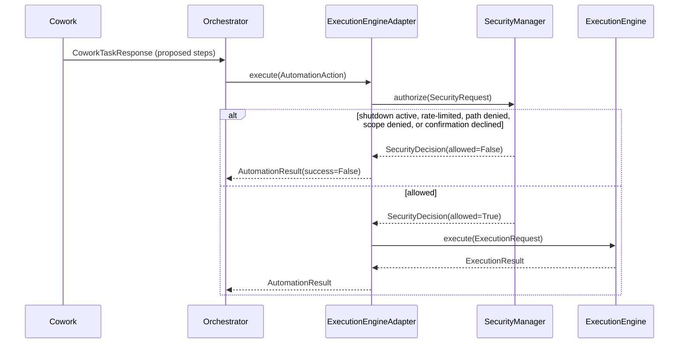

## The scope-string sharing bug

The first draft had `SecurityManager` compute a permission scope as
`f"{category}.{action}"` (e.g. `"clipboard.get"`), while
`ExecutionEngine`'s own private `_SCOPES` table separately mapped
`("clipboard", "get")` to `"clipboard.read"`. A `permissions.yaml` rule
granting `"clipboard.read"` — the scope `ExecutionEngine` actually
checks — silently didn't unlock the same action through
`SecurityManager`, so the two components could disagree about what
permission the exact same action needed. This wasn't visible from
reading either file in isolation; it surfaced running a live
rate-limiting demo end to end, where a granted action came back denied
for the wrong reason. Fixed by relocating the table out of
`core/execution/engine.py` into `core/security/levels.py` as a public
`PERMISSION_SCOPES` dict + `scope_for()`, which both modules now import
— one shared source of truth instead of two independently-maintained
copies.

## What Phase 19 deliberately does not include

- **No real confirmation UI** — `AutoDenyConfirmation` is the default
  wired in `main.py`; it fails closed (denies) rather than blocking on
  input that has nowhere to go, until a future phase wires a real
  surface (desktop dialog, voice yes/no) via `CallbackConfirmation`.
- **`SessionHistory` is keyed by `requested_by`, not a conversation
  `session_id`** — nothing in the `AutomationAction`/`ExecutionRequest`
  chain threads a chat session id this deep today; "what has this
  requester been doing" is what a security review needs, and
  `requested_by` already captures that. Wiring a real session id
  through is a natural extension, not a redesign.
- **`EmergencyShutdownActiveError` is defined but unused** —
  `authorize()` returns a `SecurityDecision(allowed=False)` rather than
  raising, so callers that inspect the decision never see it; it exists
  for a future caller that prefers exceptions.
- **Rate limiting and session history are in-memory only** — both
  reset on restart; only the audit log persists across restarts.
- **No sandboxing** — same limitation as Phase 18's plugin framework;
  `SecurityManager` decides *whether* an action is allowed to start,
  not what code does once ExecutionEngine's handlers are actually
  running.

# Phase 20 — Autonomous Workflows

Every prior phase that could act (Phase 15's `ExecutionEngine`, Phase
17's `PlanningEngine`) produced or ran a *one-shot* sequence of steps.
Phase 20's `core/workflow/` package adds the missing persistent layer
on top: a `Workflow` is *saved*, can be *run more than once* — on
demand, in the background, or on a recurring schedule — and every run
is recorded as durable history.

| Requirement | How it's addressed |
|---|---|
| Multi-step automation | `WorkflowStep.depends_on` + `dependencies.topological_waves()` — wave-by-wave execution, same Kahn's-algorithm shape as Phase 17's `topological_waves()`, reimplemented locally to keep `core/workflow/` independent of `core/planning/`'s types |
| Conditional execution | `WorkflowCondition` (`ALWAYS`/`ON_SUCCESS`/`ON_FAILURE`/`OUTPUT_EQUALS`/`OUTPUT_CONTAINS`), evaluated by the pure `conditions.evaluate_condition()`; the *default* rule when no condition is set is "run iff every dependency SUCCEEDED" |
| Background jobs | `WorkflowRunner` — a bounded worker-thread pool over `queue.Queue`, same "small state, one thread-safe primitive" shape as Phase 7's `SpeechQueue` |
| Scheduled workflows | `WorkflowSchedule` (`interval_seconds` or `cron`) + `WorkflowScheduler`, a polling background thread (same mtime-poll shape as `ConfigManager`'s watcher) that submits due workflows to `WorkflowRunner` |
| Recurring maintenance | Not a separate mechanism — just a `Workflow` with a `schedule` set, like any other scheduled workflow |
| Workflow history | `SqliteWorkflowStore.list_runs()` — every `WorkflowRun`, with per-step results, persisted durably |
| Workflow editing | `WorkflowEngine.create_workflow()`/`update_workflow()`/`delete_workflow()` — real CRUD over the same store |
| Claude Cowork generates workflow plans, Jarvis executes them | `WorkflowEngine.workflow_from_cowork_response()` — same bridge shape as Phase 17's `plan_from_cowork_response()`; steps execute via `WorkflowActionPort`, which in production (`orchestrator/workflow_adapter.py`) delegates to the exact same `AutomationPort` every other automation action already goes through, including Phase 19's `SecurityManager` gate |
| Generate workflow visualisations | `visualization.to_mermaid()` — a flowchart of steps/edges, colored by a run's per-step status when given one |

## Why conditional execution needed its own rule, not just dependency status

A plain dependency graph (Phase 17's model) only answers "did every
prerequisite finish successfully" — it can't express "run this cleanup
step *because* the previous one failed," which is exactly what
real-world maintenance/error-handling workflows need. `WorkflowStep`
therefore has two layers: the implicit default (skip if any dependency
failed, mirroring `PlanningEngine`'s cascade-skip) and an explicit
`WorkflowCondition` override for branches that need to *know* how a
dependency finished, not just whether it counts as "done."

The one constraint enforced at creation time
(`validation.validate_steps()`): a condition may only reference a
step_id that's already listed in the same step's `depends_on`. Steps
execute wave-by-wave in dependency order, so this is what guarantees
the referenced step has actually finished before its status is
inspected — a condition referencing a non-dependency could evaluate
against a step that hasn't run yet.

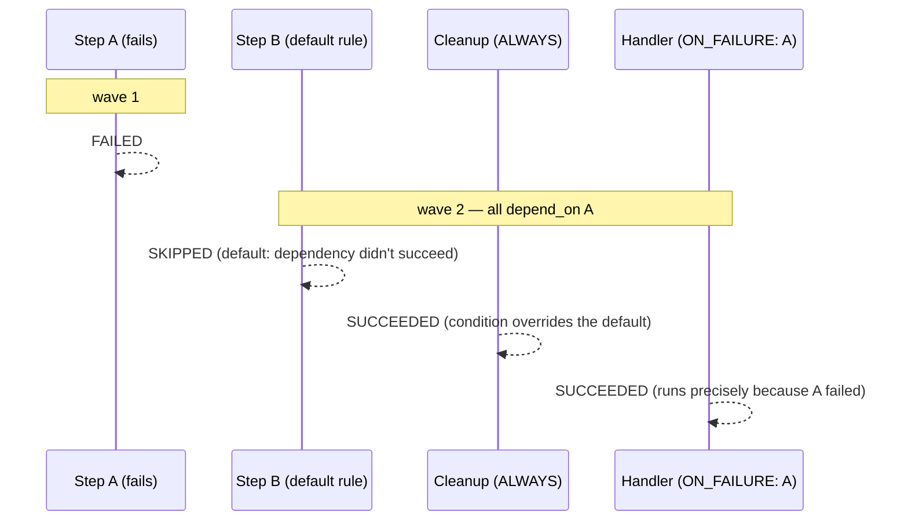

## Why cron is hand-rolled instead of a new dependency

Discussed with the user before implementation (a genuine trade-off,
not a unilateral call): a small dependency-free 5-field cron matcher
(`cron.py`) covers the maintenance-style schedules this phase targets
("daily at 2am", "every Monday at 9am") without a new optional extra,
consistent with `core/version_utils.py`'s dotted-version comparison
and `core/planning/dependencies.py`'s heuristics — this project's
established preference for a small self-contained implementation over
a new hard dependency when the common case is easy to cover correctly.
`next_run_after()` advances by whichever field currently mismatches
(month, then day, then hour, then minute) rather than stepping
minute-by-minute, so even "next December" resolves in a handful of
iterations, bounded by a 4-year search horizon that turns a
never-matches expression (e.g. "Feb 31st") into a clear error instead
of an infinite loop. One deliberate simplification from real cron:
`day` and `weekday` are ANDed, not ORed, when both are restricted —
the intuitive reading for this phase's target schedules, and avoidance
of a well-known cron gotcha.

## Why workflow steps can't bypass SecurityManager

Same structural answer as Phase 9/19: `WorkflowActionPort` is an
interface `WorkflowEngine` calls through, and its only production
implementation (`orchestrator/workflow_adapter.py`'s
`AutomationWorkflowActionPort`) does nothing but delegate to whatever
`AutomationPort` `main.py` already built — the same
`ExecutionEngineAdapter`/`SecurityManager` pairing (or
`NullAutomationPort`) every Cowork-originated action already goes
through. There is no second call into `ExecutionEngine` anywhere in
`core/workflow/`, so a workflow step is, by construction, checked by
the identical gate as everything else.

## What Phase 20 deliberately does not include

- **No workflow-level authoring UI** — workflows are created via
  `WorkflowEngine.create_workflow()` (or Cowork's
  `workflow_from_cowork_response()`); no dedicated API routes were
  added in this phase for a future dashboard/editor to call.
- **No cron OR-semantics for day/weekday** — see above; a schedule
  needing real cron OR behavior should be expressed as two separate
  scheduled workflows instead.
- **No workflow-of-workflows / sub-workflow steps** — a `WorkflowStep`
  executes exactly one dotted `category.action`, the same primitive
  every other automation action uses; composing workflows out of other
  workflows is a natural but unbuilt extension.
- **`WorkflowRunner`'s concurrency is a flat worker pool, not
  per-workflow serialization** — two runs of the *same* workflow
  submitted close together could execute concurrently; nothing in this
  phase de-duplicates or serializes runs of one workflow.
- **Scheduler drift is bounded by poll interval, not wall-clock
  precise** — a workflow scheduled for 02:00:00 fires on the next poll
  tick at or after that time (default every 30s), not to the second.

# Phase 21 — Architectural Review & Production Readiness

Requested as an unscoped sweep ("refactor all modules", "improve
performance", full UML/API/architecture docs, deployment instructions,
"production-ready"). Applying that literally to a 12,282-line,
20-phase, 92%-covered system would mean touching everything with no
specific problem driving each change — real regression risk for
unclear benefit. Instead: a full review ran first (evidence below),
findings were presented to the user, and the user picked four concrete
workstreams to execute. The fifth option offered — an open-ended
"broad refactor pass" with no specific target — was not selected.

## Review findings

| Area | Finding |
|---|---|
| Scale | 12,282 src lines / 8,679 test lines across 19 `core/` submodules + orchestrator/api/plugins |
| Test coverage | 92% (697 passing at review time). Gaps concentrated almost entirely in lazily-imported optional backends (Playwright 40%, openWakeWord 53%, Piper TTS 58%, whisper.cpp 62%, Cowork HTTP transport 67%, 2 example plugins 72-76%) — each requires the real optional dependency plus hardware/network to exercise further, and is already documented as such. Not neglect. |
| Layering | Zero real violations: grepping every `core/` file for an `orchestrator` import found exactly one hit, a `TYPE_CHECKING`-only annotation in `plugin_loader.py` (never executed at runtime). The Phase 2 rule has held for 20 phases. |
| Memory | ~25MB traced Python-level allocation at idle post-bootstrap — lean, consistent with the lazy-import-everything-optional discipline every phase since Phase 6 has followed. |
| Startup latency | Warm-process import ~1.4s + bootstrap logic ~0.3s. Import time dominated by third-party deps (fastapi/uvicorn/pydantic/click/anyio/watchfiles), not Jarvis's own code — but `uvicorn` (~0.4s of that) was imported at module level in `main.py` even though only `main()` calls `uvicorn.run()`, so every `bootstrap()`-only caller (every test, every script, `create_app()` itself) paid for it needlessly. |
| API documentation | FastAPI's `/docs` and `/openapi.json` were already live by default (not disabled) — the actual gap was route docstrings/response models and a durable, committed export. |
| Deployment | No Dockerfile, no docker-compose, no runbook existed. |
| UML/diagrams | No `pyreverse`/`graphviz` tooling installed; hand-authored Mermaid was the only real option, matching this doc's existing diagram style. |

## What was implemented

**Startup latency fix.** `uvicorn` moved from a module-level import in
`main.py` to a function-local import inside `main()`. Measured effect:
warm import time for anything that only calls `bootstrap()` dropped
from ~1.4s to ~437ms — about 1 second saved per test, per script
invocation, per `create_app()` call. Locked in with a regression test
(`tests/test_main.py::test_uvicorn_is_not_imported_at_module_level`)
that inspects `main.py`'s source to assert `import uvicorn` never
appears outside `main()`'s body — a plain "does it still run" test
wouldn't catch a regression back to a module-level import, since the
code would still work, just slower.

**A real bug found while pursuing coverage, not by looking for bugs.**
`/config`'s route handler still listed only its original 7 config
domains by hand (`settings`/`permissions`/`voice`/`memory`/`plugins`/
`filesystem`/`cowork`) — 5 phases (13, 15, 17, 19, 20) had each added a
new config domain (`vault`, `execution`, `planning`, `security`,
`workflow`) without anyone updating this diagnostic endpoint, and a
test asserting exactly those 7 keys (`test_config_endpoint_returns_
all_seven_domains`) was actively enforcing the staleness rather than
catching it. Fixed by building the response from `LoadedConfig`'s own
`dataclasses.fields()` instead of a hand-written dict — a future 13th
config domain shows up here automatically, the same way it's already
automatic in `ConfigManager._files()`/`_load_all()`. The test was
rewritten the same way, asserting against `LoadedConfig`'s fields
rather than a fixed set of names, so it can't silently drift again.
Also found (and fixed): every test calling `bootstrap()` leaked
`WorkflowRunner`'s worker threads and `WorkflowScheduler`'s polling
thread for the rest of the test session — only `ConfigManager`'s
watcher was being stopped in `tests/test_main.py`'s cleanup. Threads
were daemon threads so nothing broke, but it was pure waste; fixed by
stopping all three in a shared `_shutdown()` helper.

**Targeted test coverage.** 13 new tests added for pure-Python gaps
that don't require an optional backend or real hardware: `ServiceContainer`'s
overwrite-warning branches and `keys()`; `EventBus`'s unsubscribe-not-
registered warning and `publish_async`'s exception isolation;
`env_overrides()`'s "has `__` but still one segment" edge case;
`PluginLoader`'s import-failure isolation (one broken external module
must not prevent the others from loading) and `_dependency_order()`'s
cyclic-batch fallback; `Orchestrator`'s memory-backend-raises isolation
(both `recall()` and `remember()`) and a Cowork `"respond"`-type plan
step (as opposed to the already-tested `"automation"` type). Net
effect: 392 → 374 missed statements, 697 → 710 passing tests. Gaps
requiring a real OS-level failure to simulate (e.g. `filesystem/
service.py`'s `OSError` branches during write/copy/move) were left
alone — mockable but lower value than the ones above, and out of
"targeted."

**UML and architecture documentation.** New `docs/diagrams.md`: a
system component diagram (package-level dependency graph, doubling as
visual proof of the layering claim above) plus class diagrams for the
three most structurally central packages — `core/security/`,
`core/workflow/`, and `orchestrator/` — and the config-domain
relationship. A table of contents was added to the top of this
document (2,454 lines before Phase 21, genuinely hard to navigate
without one). `/health`, `/config`, and `/message` gained
`summary`/`description` text and (`/health`, already-existing
`/message`) typed `response_model`s, so the auto-generated OpenAPI
schema/Swagger UI are actually useful rather than bare route stubs.
`scripts/export_openapi.py` writes a durable, diffable
`docs/openapi.json` without needing a running server or full
`bootstrap()` — only `create_app()` and a minimal container.

**Deployment instructions.** New `Dockerfile` (multi-stage: a builder
stage with a venv, a slim runtime stage with a non-root user and a
`HEALTHCHECK` against `/health`), `.dockerignore`, `docker-compose.yml`
(named volumes for `data/`/`logs/`/`plugins/`/`vault/`, `config/`
bind-mounted for live editing, `.env` for secrets), and
`docs/deployment.md` — a runbook covering environment variables,
health checks, filesystem-allowlist path caveats inside a container,
persistence/backups, and, explicitly, what does *not* run the same way
containerized: desktop automation and voice both need a real
display/input devices/audio hardware a container doesn't have, so
those capabilities are documented as bare-metal-only rather than
silently broken. The base `pip install .` and `pip install .[cowork]`
paths the Dockerfile depends on were verified in a clean venv (Docker
itself wasn't available in this environment, so the actual image build
was not run — see "what's deliberately not covered" below).

## What was deliberately not done

- **No broad refactor** — the option was offered and not selected;
  the review found no urgent structural problem that would justify the
  regression risk of touching all 20 phases' working code.
- **Docker build was not actually executed** — Docker wasn't available
  in this environment. The packaging step it depends on (`pip install
  .`, `pip install .[cowork]`) was verified directly in a clean venv;
  the Dockerfile/compose file syntax was not run through `docker
  build`/`docker compose up`.
- **Remaining coverage gaps in optional backends** — Playwright, Piper,
  whisper.cpp, openWakeWord, the Cowork HTTP transport, and 2 example
  plugins remain at their pre-Phase-21 coverage; closing those needs
  the real dependency installed (or a much heavier mocking investment)
  and was out of "targeted."
- **`/config` still has no authentication** — flagged again in both
  the route's own docstring and `docs/deployment.md`; unchanged from
  Phase 2's original "what's deliberately missing" list.
- **No CI pipeline** — "production-ready" commonly implies one; none
  was requested or added here.

# Phase 22 — The Prompt Registry

Suggested directly by the user, in response to Phase 10's
`CollaboratorSpec.prompt_template` being a hardcoded Python string per
role: since Cowork's collaborator behavior lives entirely in prompt
text, that text should be version-controlled Markdown, editable
independently of application code, not buried in `collaborators.py`.

The user's proposed file list didn't map 1:1 onto the 8 existing
`CollaboratorRole`s, so two scoping questions were resolved with the
user via `AskUserQuestion` before writing any code:

1. **Split `automation_engineer` into separate `browser`/`desktop`
   roles, or keep one?** Kept one (`automation_engineer.md`) — a split
   would mean changing `CollaboratorRole` itself, which Phase 17's
   `PlanningEngine` and `workspace.py`'s routing heuristic both depend
   on directly; a bigger, separate decision than "externalize the
   prompt text."
2. **What about `system.md`, `orchestrator.md`, `security.md`, which
   don't correspond to any Cowork role?** Kept `system.md` (a shared
   preamble prepended to every rendered prompt); dropped the other
   two — Jarvis's `Orchestrator` and `SecurityManager` are local
   Python logic with no LLM prompt to externalize, and a file nothing
   reads would violate this project's "no speculative/unused code"
   convention.

| Requirement | How it's addressed |
|---|---|
| Prompts as version-controlled Markdown | New `prompts/` directory: `system.md` + one file per role (`architect.md`, `planner.md`, `coder.md`, `researcher.md`, `memory.md`, `automation_engineer.md`, `documentation.md`, `qa.md`) |
| Dynamically loaded when invoking a collaborator | `core/cowork/prompts.py`'s `PromptRegistry.render()` reads the relevant file fresh on every call — no caching, no watcher thread. A `prompts/*.md` edit takes effect on the very next Cowork request |
| Refine a collaborator without changing application code | Editing a `.md` file is the entire change; nothing in `collaborators.py` or `workspace.py` needs to change |
| Keeps AI behavior versioned alongside the rest of the project | `prompts/` is an ordinary directory in the repo, diffable and reviewable like any other file |

## Why this didn't touch `CollaboratorSpec.responsibilities`/`boundaries`

Only `prompt_template` — the literal text sent to Cowork — moved to
`prompts/*.md`. `responsibilities`/`boundaries` stayed as Python list
metadata on `CollaboratorSpec`: they're not prompt text, they're
self-documentation already consumed by `test_collaborators.py`'s
structural checks (e.g. "every boundary forbids direct execution").
Moving them to Markdown too would mean parsing structured data out of
prose (frontmatter, most likely), a bigger and separately-decidable
change than what was asked for.

## Backward compatibility: `PromptRegistry` is optional everywhere

`CollaboratorSpec.render_prompt()` gained an optional `registry`
parameter; `CoworkWorkspace` gained an optional `prompt_registry`
parameter. Neither defaults to anything but `None`, and both fall back
to exactly Phase 10's behavior (the hardcoded `prompt_template` string)
when no registry is given, or when a registry is given but a specific
role's file — or `prompts/` itself — doesn't exist. `main.py` always
constructs a real `PromptRegistry` (no `enabled` flag, same "always
real, built-in fallback" reasoning as Phase 20's `WorkflowEngine`), but
every existing test and caller that doesn't wire one in continues to
behave identically, verified by re-running the full pre-existing
`test_collaborators.py`/`test_workspace.py` suites unchanged.

## A small, honest behavior change: `system.md`'s boundary text is now actually sent to Cowork

Before this phase, `_BASE_BOUNDARY` ("Never execute anything directly;
only return data for Jarvis to act on.") existed only as the first
entry in every role's Python `boundaries` list — self-documentation
for Jarvis's own codebase, never actually part of the text sent to
Cowork. `system.md` contains this same sentence and is now genuinely
prepended to every rendered prompt. This is a real behavior change,
called out explicitly rather than glossed over — though not a change
to what Cowork is *capable* of: the structural guarantee that Cowork
can't execute anything was never about prompt wording in the first
place. `CoworkPlanStep` (Phase 9) has no `execute()` method; that's
what actually enforces the boundary, regardless of what any prompt
says. `system.md` is defense-in-depth on top of that, not a
replacement for it.

## What Phase 22 deliberately does not include

- **No `browser.md`/`desktop.md` split, no `orchestrator.md`/
  `security.md`** — see the scoping decisions above.
- **No prompt versioning/rollback beyond git** — `prompts/*.md` is
  tracked the same way any other file in the repo is; there's no
  in-app history, diff view, or rollback UI.
- **No validation that a `.md` file still contains `{instruction}`** —
  a malformed template (missing the placeholder, or a stray `{`/`}`)
  fails with Python's own `str.format()` `KeyError`/`ValueError` at
  render time, not at startup or at file-save time.
- **No live-reload watcher** — deliberately unnecessary: reading fresh
  on every `render()` call already gives "edit takes effect
  immediately" without the added complexity of a background thread
  polling for changes, since a Cowork request already touches disk
  once per call regardless.

# Voice Wiring — Real Microphone/Speaker I/O

Every piece of `JarvisVoicePipeline` (Phase 11) — wake word, VAD, STT,
TTS, queueing, barge-in, conversation mode — was fully built and
tested against fakes, but nothing ever constructed one with a *real*
`MicrophonePort`/`AudioPlayerPort` or started it from `main.py`. This
phase closes that gap: it's the difference between "the voice pipeline
works" (true since Phase 11) and "you can actually talk to Jarvis"
(true as of this phase, given the prerequisites below).

## What was added

- `core/speech/sounddevice_io.py`'s `SoundDeviceMicrophone`/
  `SoundDeviceAudioPlayer` — the first real `MicrophonePort`/
  `AudioPlayerPort` implementations, backed by the `sounddevice`
  library (PortAudio bindings). `sounddevice` was picked over
  `pyaudio` for the same reason `pywhispercpp`/`piper-tts`/
  `openwakeword` were picked over subprocess/CLI alternatives in
  Phases 6-8: prebuilt wheels (including on Windows), no native build
  step. Both classes lazy-import `sounddevice` inside `start()`/
  `play()`, matching every other real speech backend's "constructing
  the class never requires the dependency" contract.
  - `SoundDeviceMicrophone` captures on PortAudio's own callback
    thread and hands each block to a bounded `queue.Queue`; a full
    queue drops the *oldest* chunk rather than blocking the real-time
    callback or raising — a pipeline that's fallen behind should lose
    stale audio, not stall live capture further.
  - `SoundDeviceAudioPlayer.play()` uses `sounddevice.play()` (already
    non-blocking) at whatever sample rate the `AudioChunk` itself
    reports — TTS output format stays a synthesis-time concern owned
    by the `TextToSpeechPort` backend, not the player. `is_playing` is
    cleared by a daemon thread blocked in `sounddevice.wait()`, so no
    polling loop is needed to notice playback finished.
- `VoiceConfig` gained `mic: MicrophoneConfig` / `player:
  AudioPlayerConfig` (device selection, sample rate/channels/block
  size, internal queue bound) — the first device-level fields voice
  config has ever needed, since only Null/test-double ports existed
  before.
- `main.py`'s `bootstrap()` gained a new step 7 (renumbering the
  previously-8-10 steps to 8-11): behind `voice.yaml`'s `enabled` flag
  (default `false`, unchanged), it builds real
  `OpenWakeWordDetector`/`WebRtcVoiceActivityDetector`/
  `WhisperCppSpeechToText`/`PiperTextToSpeech`/`SoundDeviceMicrophone`/
  `SoundDeviceAudioPlayer`, wires `AssistantHandler` as the
  `lambda text, sid: orchestrator.handle(Request(text=text,
  session_id=sid, source="voice")).text or ""` shape `core/voice/
  ports.py` has documented since Phase 5, constructs a
  `JarvisVoicePipeline`, and starts it as a background thread. `main()`
  stops it in the shutdown `finally` block alongside the workflow
  runner/scheduler.

## Why there's no Null Object default for the voice pipeline itself

Every other optional subsystem wired into `bootstrap()`
(memory/automation/vault/cowork) is a **port** — something other code
resolves and calls through, so a Null Object gives callers a safe,
correct "no backend configured" default. A `VoicePipeline` isn't a
port anything else depends on; it's a self-contained background loop
that either exists and runs, or doesn't exist at all. So when
`voice.yaml`'s `enabled` is `false` (the default), `bootstrap()`
simply registers nothing — there's no `NullVoicePipeline` standing in,
because nothing would ever call it.

## Why enabling voice without the extra installed is a fatal startup error, not a graceful skip

`execution.yaml`'s desktop/clipboard/screenshot/window handlers fall
back to Null ports when their optional dependency is missing, even
with the engine itself enabled — because *most* of `ExecutionEngine`
(filesystem/terminal/application) works without that extra. Voice
doesn't have an equivalent "works without it" core: every single
backend a voice pipeline needs (mic, wake word, STT, TTS, player)
requires the `voice` extra. Given that, silently degrading would mean
`voice.yaml`'s `enabled: true` produces a process that *looks* started
but can never actually hear or speak — worse than failing loudly.
So `bootstrap()` lets `SpeechBackendUnavailableError` propagate out
uncaught, consistent with the module docstring's existing "a
validation failure here is fatal — the process must not start with
broken config" posture for config loading itself.

## Prerequisites this phase does not and cannot provide

Wiring the pipeline together doesn't make voice work out of the box —
two real, unavoidable gaps remain:

1. **The `voice` extra must be installed**: `pip install -e '.[voice]'`
   (or `pip install -r requirements-voice.txt`) — `openwakeword`,
   `pywhispercpp`, `webrtcvad`, `piper-tts`, `numpy`, and now
   `sounddevice`. These are large, compiled, platform-sensitive
   packages; none are in the base install.
2. **Model files must be downloaded separately** — they're binary
   assets, not something `pip install` or this codebase can produce:
   - **Whisper.cpp (STT)**: a `ggml-*.bin` model from
     [ggerganov/whisper.cpp's model repo](https://huggingface.co/ggerganov/whisper.cpp)
     (e.g. `ggml-base.en.bin`), placed at the path `voice.yaml`'s
     `stt.model_path` points to (default
     `data/models/whisper/ggml-base.en.bin`).
   - **Piper (TTS)**: a voice `.onnx` + its `.onnx.json` config from
     [rhasspy/piper's voice list](https://github.com/rhasspy/piper/blob/master/VOICES.md)
     (e.g. `en_US-lessac-medium`), placed at `tts.model_path`.
   - **openWakeWord (wake word)**: built-in model names (e.g.
     `hey_jarvis`) download automatically on first use per
     openWakeWord's own packaging; custom-trained `.onnx`/`.tflite`
     files go in `wake_word.models` as file paths.

   Enabling `voice.yaml` without these files present fails with a
   clear `SpeechBackendUnavailableError` naming the missing path — see
   `core/speech/whisper_cpp.py`/`piper_tts.py`/`wake_word.py`'s
   existing `_ensure_model()` checks, unchanged by this phase.
3. **sounddevice's exact callback-stream API was not verified against
   a locally installed copy** in this environment — implemented
   against its documented shape, the same unverified-API caveat every
   other real speech backend in this package already carries (see
   Phase 6/7/8's sections above).

## What this phase deliberately does not include

- **No packaged model files** — see above; a `data/models/` populated
  with real binaries is outside what a code change can provide.
- **No CLI/text chat loop** — `POST /message` remains the only
  non-voice entry point into `Orchestrator.handle()`; voice is now a
  second, independent entry point into the same orchestrator, not a
  replacement for the first.
- **No device-selection UI** — `mic.device`/`player.device` are config
  fields (int index or name substring), set by editing `voice.yaml`
  after checking `python -m sounddevice` for what's available.
- **No resampling** — `SoundDeviceMicrophone` captures at whatever
  `mic.sample_rate` says (16000 by default, matching whisper.cpp/
  webrtcvad/openWakeWord's fixed expectation); changing it without
  updating every downstream backend will fail loudly at the first
  `SpeechError` a mismatched sample rate trips, not silently
  misbehave.

# Cowork Correction & Enabling All Capabilities

Immediately after the voice-wiring phase, the user asked to enable
every capability and provided a real Claude API key. That surfaced two
real bugs — one architectural, one in the PyInstaller packaging — plus
the deliberate work of turning on every optional subsystem.

## Bug: Cowork was calling a product that doesn't exist

Since Phase 9, `core/cowork/http_transport.py` POSTed to
`https://api.anthropic.com/cowork/v1/tasks` with an `Authorization:
Bearer` header — a shape invented before Cowork's real API was
verified (the module docstring said as much at the time). That
verification never happened, because there is no "Claude Cowork" HTTP
product to verify against. The real Claude API is `POST
/v1/messages`, authenticated via `x-api-key` (not `Authorization:
Bearer`) plus an `anthropic-version` header. With the user's real key
set, this would have 404'd on every request.

**Fix**: `HttpCoworkTransport` now calls the real Claude Messages API
via the official `anthropic` Python SDK (never raw HTTP — this
project's own tooling guidance requires the SDK when one exists).
`CoworkClient` (retry/timeout/backoff/diagnostics) needed zero changes
— it was already decoupled from the transport via `CoworkTransport`'s
`post_json(path, payload, timeout)` seam, precisely the separation
Phase 9 built for testability. The plan-of-steps contract
(`CoworkTaskResponse`/`CoworkPlanStep`) is now produced via Claude's
structured outputs (`output_config.format` + a JSON Schema) instead of
hypothetical free-text parsing — a step's automation parameters travel
as a JSON-encoded string field (`automation_parameters_json`) rather
than an open dict, since structured-outputs schemas require
`additionalProperties: false` throughout and a genuinely free-form
params object can't satisfy that; the transport parses it back into a
real dict before returning. `CoworkConfig` gained a `model` field
(default `claude-opus-5`) and `refusal` stop-reason handling. Verified
against the real API with the user's key: the request authenticated
and reached the model (a 400 "credit balance too low" response,
confirming the endpoint/auth/retry chain all work correctly — not an
auth or 404 error like the old fictional endpoint would produce).

## Bug: the packaged exe silently loaded every config default

`core/config/_paths.py`'s `PROJECT_ROOT = Path(__file__).resolve()...`
is only correct running from source. Inside a PyInstaller onefile
build, every bundled module's `__file__` resolves into the temporary
extraction directory (`sys._MEIPASS`, a fresh `%TEMP%\_MEIxxxxx` each
run), so `DEFAULT_CONFIG_DIR`/`PathsSettings.resolved()` pointed at a
`config/` that never existed. `ConfigManager`'s existing fail-safe
"missing directory → every domain's pydantic defaults" behavior
activated silently — no error, no warning, just every capability
reading as its default (off). This was invisible for as long as every
domain's default happened to be off; enabling capabilities is what
exposed it — `jarvis.exe` kept reporting `voice: enabled=false` no
matter what `config/voice.yaml` said. Fixed by detecting `sys.frozen`
and using `Path(sys.executable).resolve().parent` instead — the same
directory `scripts/run_jarvis_exe.py` already `os.chdir()`s to, now
the source of truth for every module that computes `PROJECT_ROOT`,
not just the entry point. Regression test:
`tests/core/config/test_paths.py`.

## Capabilities enabled

`cowork.yaml`, `execution.yaml` (including its `browser.enabled`
sub-flag), `memory.yaml` (`long_term` + `semantic`), and `vault.yaml`
are now all `enabled: true` in this repo's checked-in config —
previously every one of these defaulted off. `permissions.yaml` gained
a rule granting the `cowork` requester the automation scopes
`ExecutionEngine` needs (filesystem read/write, desktop mouse/
keyboard, application launch/close, clipboard, screenshot, window
control, browser control) — `default_policy: deny` with an empty
`rules: []` would otherwise block every automation action regardless
of `execution.yaml`'s `enabled` flag, since `SecurityManager` checks
`PermissionsConfig.is_allowed()` first (Phase 19). `terminal.run` was
deliberately left out of that grant, and `execution.yaml`'s
`terminal.allowed_commands` stays empty — arbitrary shell command
execution is a distinct, larger grant than the rest and wasn't
requested explicitly.

`main.py`'s desktop/clipboard/screenshot/window handlers changed from
always-Null to real (`PyAutoGuiDesktopAutomation`/`PyperclipClipboard`/
`PillowScreenshotter`/`PyGetWindowManager`) whenever `execution.yaml`
is enabled — previously Null even when the engine itself was enabled,
since the project couldn't assume the `desktop` extra was installed.
Construction is still unconditional and side-effect-free (each
lazy-imports its dependency on first real call, same as every other
optional backend in this project), so this is safe regardless of
whether a given deployment has the extra.

`voice.yaml`'s `listening.mode` changed from `push_to_talk` to
`continuous` (with `background: true`, `conversation_mode: true`) —
push-to-talk requires a button that doesn't exist in this deployment;
continuous + `wake_word.enabled` (already on by default) is what makes
"say 'hey jarvis', it starts listening" work at all.
`streaming.pause_duration_seconds` raised from 0.8 to 1.5 seconds to
match "a few seconds of not speaking" before Jarvis finalizes and acts
on an utterance.

**Real bug found while enabling wake word, not by reading the code**:
`OpenWakeWordDetector._ensure_model()` never called
`openwakeword.utils.download_models()` — built-in model names like
`hey_jarvis` are not bundled with the `openwakeword` package and do
NOT download on first use despite what this project's own earlier
documentation (README, this file's voice-wiring section) claimed.
Constructing `Model()` without the files first raises a raw
`onnxruntime.NoSuchFile` error, not something a caller could recognize
as "just needs downloading." Fixed by calling `download_models()`
(a no-op once already downloaded) before constructing `Model()` for
any built-in model name; custom `.onnx`/`.tflite` paths are unaffected
since they're already file-existence-checked separately. Caught by
actually running the detector end-to-end against real silence, not by
reading the code — the same recurring pattern this project's phase
history keeps surfacing.

**Verified live, not just via bootstrap()**: real STT
(`WhisperCppSpeechToText`, downloaded `ggml-base.en.bin`) transcribed
silence correctly; real TTS (`PiperTextToSpeech`, downloaded
`en_US-lessac-medium`) synthesized audio; real wake-word detection
scored real microphone input without a false trigger; a full
`bootstrap()` with everything enabled (Cowork, execution, browser,
memory, vault, voice) started cleanly, reached `waiting_for_wake_word`
against a real microphone, and stopped cleanly. This was all run on a
machine with real audio hardware and real internet access, not
simulated — the environment genuinely supports the full pipeline.

## What this phase deliberately does not include

- **No terminal command execution** — `terminal.allowed_commands`
  stays empty and `permissions.yaml`'s `cowork` rule excludes
  `terminal.run`; enabling arbitrary shell execution is a distinct,
  larger security decision than what was asked.
- **No plugins** — `plugins.yaml` still has zero plugins enabled, so
  the local `CapabilityRegistry` remains empty and every message still
  routes to Cowork (or `unhandled` if Cowork is unavailable). "All
  capabilities work" here means every *subsystem* Jarvis can call into
  is live, not that bespoke plugin capabilities exist.
- **Cowork's Anthropic account needs credits** — the transport is
  correct and verified reaching the real API; the account used in this
  session returned an HTTP 400 credit-balance error, which is a
  billing state outside this codebase's control.
