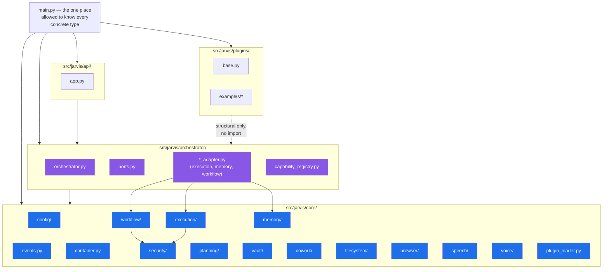
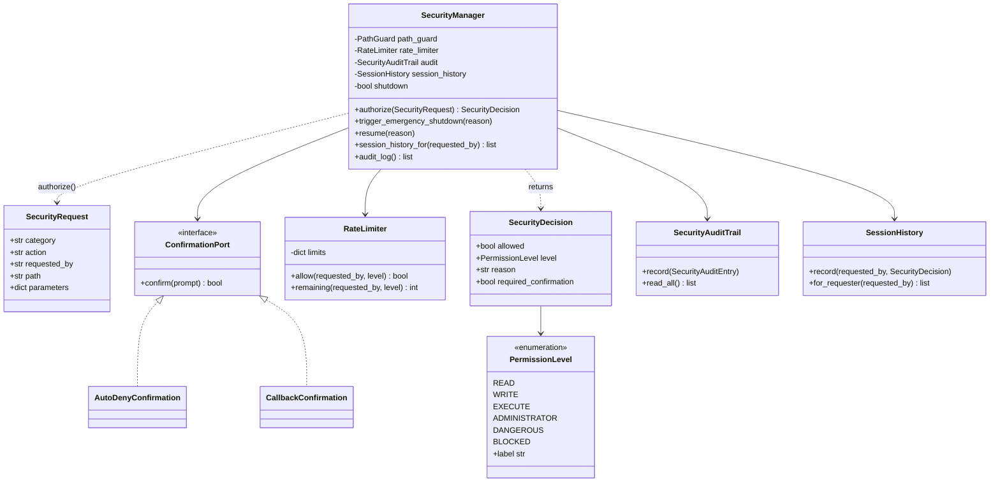
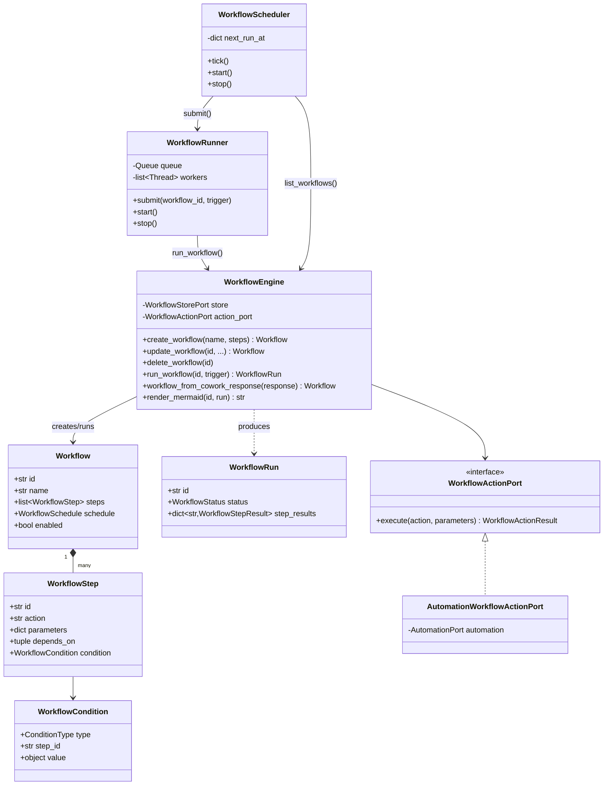
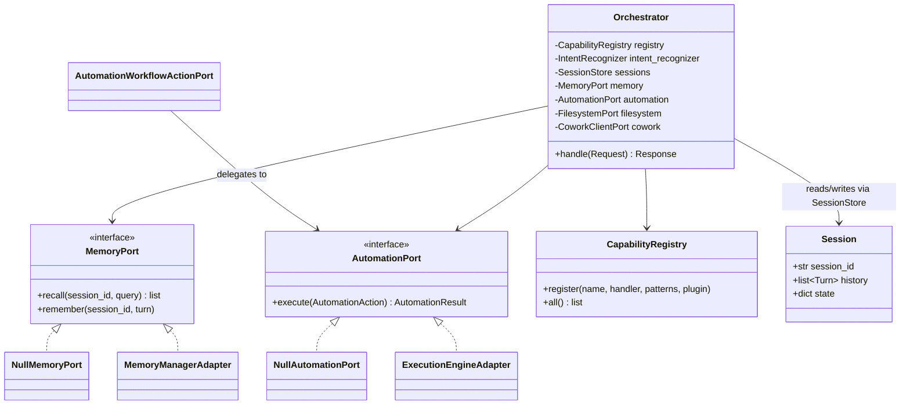
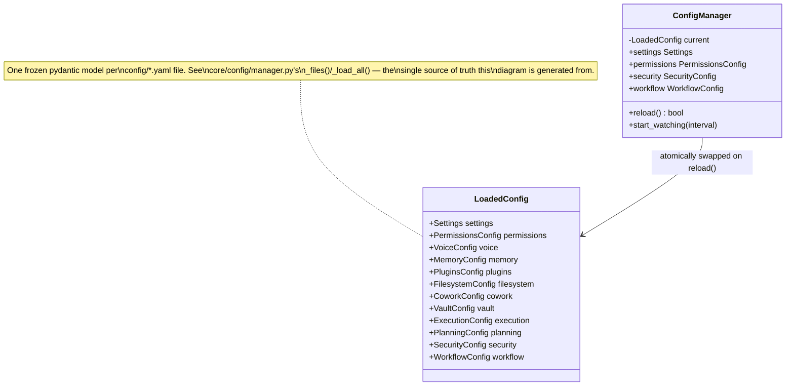

# Jarvis — UML & Component Diagrams

Hand-authored Mermaid diagrams (no UML-generation tooling is installed
— see `docs/architecture.md`'s Phase 21 section for why), covering the
system's static structure. For *behavioral* diagrams (request/response
sequences), see the sequence diagrams already embedded in the relevant
phase sections of `docs/architecture.md` — this file is the static
counterpart: what depends on what, and each package's key classes.

## System component diagram

The layering rule that has held since Phase 2, verified by grep across
every `core/` file before this diagram was drawn (the only
`orchestrator` reference inside `core/` is a `TYPE_CHECKING`-only
annotation in `plugin_loader.py`, never a real runtime dependency):
`core/` never imports `orchestrator/`; `orchestrator/` depends on
`core/`, never the reverse; `main.py` is the only module allowed to
import every concrete type in the system.

## `core/security/` — the Security Manager (Phase 19)

## `core/workflow/` — Autonomous Workflows (Phase 20)

## `orchestrator/` — request handling (Phase 2, extended through Phase 20)

## Config domains (Phase 3, grown to 12 domains through Phase 20)

